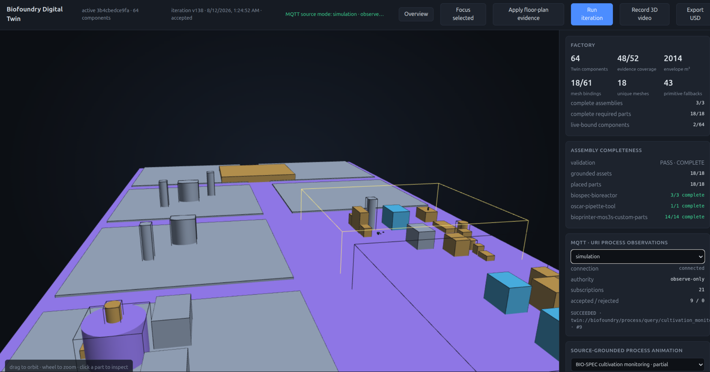
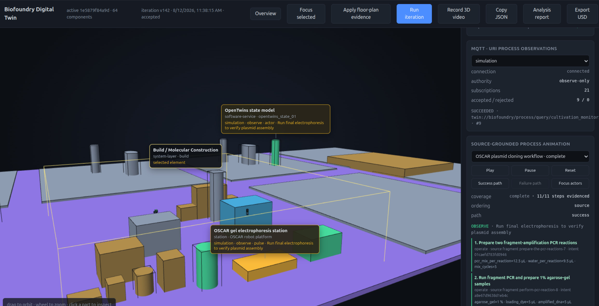
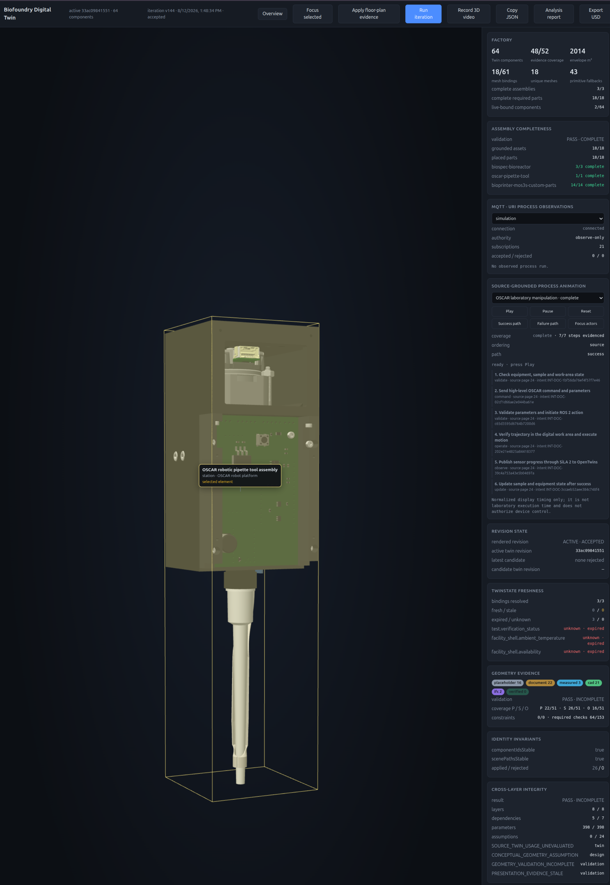

# Subactor Digital Twin Runtime Starter 0.5.36

An auditable, dependency-light runtime for building a living Digital Twin from documents, observations, physical evidence, process definitions, and real-time MQTT events.

The runtime keeps three loops separate:

1. The knowledge loop converts and validates source material.
2. The development loop compares intent with code, tests, and Git through `todo2code`.
3. The execution loop publishes Twin and Scene revisions only after deterministic runtime gates pass.

```text
files / directories / ZIP / web
  -> resourceDSL -> treeDSL / queryDSL / mathDSL
  -> intentDSL and todo2code diagnostics
  -> observationDSL / LiveBindingDSL / TwinState
  -> AssemblyDSL / ProcessDSL / AnimationDSL
  -> twinDSL -> sceneDSL -> OpenUSD -> dashboard
  -> analysis trace, integrity report, and improvementDSL
```

LLMs may propose schema-bound `patchDSL`. They do not own authority rules, validation math, component identities, source hashes, or direct device execution.

## Requirements

- Node.js 22 or newer
- Docker Compose for ClickHouse, Docling, and MQTT services
- OpenSCAD when compiling SCAD geometry
- Python 3.10 or newer for the Python `f2md` package
- Optional sibling checkout: `~/github/semcod/todo2code`

## Quick start

```bash
npm install
npm run build
npm test
make up
```

`make up` starts the support services and runs the runtime doctor. It does not start the dashboard.

```bash
make endpoints
make service-check
make logs
make down          # preserve service volumes
make down-clean    # remove service volumes
```

Default host endpoints:

| Service | Address |
| --- | --- |
| ClickHouse HTTP | `http://127.0.0.1:18123` |
| ClickHouse native | `127.0.0.1:19000` |
| Docling health/API | `http://127.0.0.1:15001/health` |
| MQTT | `mqtt://127.0.0.1:18883` |
| Dashboard | `http://127.0.0.1:7331/` |

Configuration defaults are documented in `.env.example`. Copy it to `.env` and set only the values required by the selected runtime mode.

## Dashboard

Start the dashboard from the bioxfoundry workspace:

```bash
cd /home/tom/github/bioxfoundry
make dashboard PROJECT=nanobionic-laboratory-md PORT=7331
```

Or invoke the runtime directly:

```bash
node dist/src/cli/main.js dashboard \
  <project.projectdsl> \
  <runtime-output-directory> \
  7331 \
  deterministic
```

The dashboard exposes the accepted Twin, Scene, OpenUSD, validation reports, process state, MQTT observations, and rejected-candidate diagnostics. Selection and active-process labels identify individual scene actors. The top toolbar can copy the complete stage state as JSON for debugging and download the active project description as Markdown, standalone HTML or PDF.

See [Dashboard](docs/DASHBOARD.md), [project documentation export](docs/PROJECT_DOCUMENTATION_EXPORT.md), and [Process DSL and animation](docs/PROCESS_DSL_AND_ANIMATION.md).

### Historical dashboard iterations

The screenshots below are retained as a visual history of dashboard and Scene development. They
show successive implementation iterations; they are not presentation evidence for the current
Twin revision unless a `subactor.presentation-evidence/v1` manifest binds the exact image hash to
the active Twin and Scene URIs.

#### Iteration 1


#### Iteration 2


#### Iteration 3


#### Iteration 4


#### Iteration 5


#### Iteration 6


#### Iteration 7


#### Iteration 8



#### Iteration 9



#### Iteration 10



## Convert source material to Markdown

The Python and JavaScript `f2md` packages normalize PDF, Office, HTML, text, archives, and geometry metadata into Markdown with provenance.

```bash
python -m pip install -e 'py/f2md[pymupdf,translate]'

PYTHONPATH=py/f2md/src python -m f2md.cli \
  --tree ../nanobionic-laboratory ../nanobionic-laboratory-md
```

The output tree mirrors the source tree. Each generated Markdown document carries its source path, digest, converter identity, media type, and conversion state. Confidential translation stays on the local Argos path; hosted translation is optional and must not receive confidential material.

```bash
PYTHONPATH=py/f2md/src python -m f2md.audit \
  ../nanobionic-laboratory \
  ../nanobionic-laboratory-md \
  --json > audit-report.json
```

See [f2md artifact pipeline](docs/F2MD_ARTIFACT_PIPELINE.md), [conversion audit](docs/AUDIT_AND_INTENT_VALIDATION.md), and [archive extraction](docs/ARCHIVE_PROJECT_EXTRACTION.md).

## Build and verify intentDSL

The canonical Markdown corpus is compiled into provenance-bound intent packs. The active Twin must be traceable back to exact source pages and hashes.

```bash
cd /home/tom/github/bioxfoundry
make dsl-rebuild
make dsl-verify
make specification-validate
```

`todo2code` remains the canonical Intent Evidence DSL for commands, plans, code, Git, documentation, and Intent-vs-Reality diagnostics. `twin-dsl` consumes its deterministic result and may request an optional, locally validated `patchDSL` enrichment.

See [todo2code integration](docs/TODO2CODE_INTEGRATION.md), [OpenRouter NL to DSL](docs/OPENROUTER_NL_TO_DSL.md), and [specification validation](docs/SPECIFICATION_DSL_VALIDATION.md).

## Create a living project

```bash
node dist/src/cli/main.js project-create \
  /home/tom/github/bioxfoundry/projects/my-twin \
  my-twin

node dist/src/cli/main.js project-add-source \
  /home/tom/github/bioxfoundry/projects/my-twin/project.projectdsl \
  customer \
  /absolute/path/to/source

node dist/src/cli/main.js project-iterate \
  /home/tom/github/bioxfoundry/projects/my-twin/project.projectdsl \
  deterministic
```

Continuous operation:

```bash
node dist/src/cli/main.js project-watch \
  /home/tom/github/bioxfoundry/projects/my-twin/project.projectdsl \
  deterministic
```

Every accepted revision records stable component identities, source snapshots, generated artifacts, validation results, and an analysis trace. Rejected candidates remain separate from the active revision.

Generate a portable project report from the accepted artifact set:

```bash
node dist/src/cli/main.js project-documentation \
  /path/to/project.projectdsl \
  /path/to/.living-runtime \
  /path/to/.living-runtime/current/documentation
```

This writes a revision-bound JSON contract, Markdown, standalone HTML, PDF and SHA-256 manifest.

See [project wizard](docs/PROJECT_WIZARD.md), [continuous loop](docs/CONTINUOUS_DIGITAL_TWIN_LOOP.md), [analysis trace](docs/ANALYSIS_TRACE.md), and [project documentation export](docs/PROJECT_DOCUMENTATION_EXPORT.md).

## Physical evidence and geometry

Conceptual boxes and cylinders are honest placeholders. They are replaced only by stronger evidence such as measured dimensions, floor plans, CAD/IFC, verified meshes, or build receipts.

```bash
node dist/src/cli/main.js physical-intake \
  <physical-evidence.json> \
  <twin.json> \
  <scene.json> \
  <output-directory>

node dist/src/cli/main.js scene-render \
  <scene.json> \
  <twin.json> \
  <scene.usda>
```

Geometry compilation is content-addressed and fail-closed. Build receipts bind the engine, parameters, dependencies, source hash, output hash, coordinate system, and reference validation. Reference models downloaded from the web are labelled as substitutes until as-built evidence is supplied.

See [physical evidence intake](docs/PHYSICAL_EVIDENCE_INTAKE.md), [geometry compilation](docs/GEOMETRY_COMPILATION.md), [semantic scene blueprint](docs/SEMANTIC_SCENE_BLUEPRINT.md), and [detail audit](docs/DIGITAL_TWIN_DETAIL_AUDIT.md).

## Processes, animation, and MQTT

`ProcessDSL` describes sourced workflow steps, actors, parameters, transitions, and evidence coverage. `AnimationDSL` maps semantic process activity onto scene components or assemblies. `MqttBindingDSL` binds observe-only MQTT topics to exact URI Process routes and Twin properties.

The default hardware boundary is observe-only. Receiving telemetry does not grant permission to actuate equipment. Device control requires a separate authority contract, a valid mutation grant where applicable, deterministic validation, and an explicit execution adapter.

See [Process DSL and animation](docs/PROCESS_DSL_AND_ANIMATION.md), [real-time biofoundry](docs/REALTIME_BIOFOUNDRY.md), and [project integrity](docs/PROJECT_INTEGRITY_DSL.md).

## LLM boundary

Every hosted-model context includes:

- the target JSON Schema;
- the patch envelope schema;
- the GGML GBNF grammar;
- `BASE_SHA256` for the canonical base state;
- the exact allowlist of mutable paths.

The model returns only `subactor.patch-envelope/v1`. A deterministic parser verifies the target, baseline hash, operations, and paths, applies the patch to a copy, and passes the result through the domain validator. Provider failure can change explanatory prose or cause an explicit degraded mode; it cannot change deterministic findings.

## Verification

```bash
npm run verify
```

From the bioxfoundry workspace:

```bash
cd /home/tom/github/bioxfoundry
make check      # tests and checks; demos skipped
make verify     # full local CI, including demos
make report     # write .ci-reports/status.md
```

The local pre-push hook blocks `main` when an error-level diagnostic, test, schema check, specification check, or required CI stage fails. A skipped stage is reported as skipped and never presented as a pass.

Stable error codes link to `error/<CODE>.md`, which explains the condition and corrective actions.

## Documentation

- [Architecture](docs/ARCHITECTURE.md)
- [DSL specification](docs/DSL_SPEC.md)
- [Dashboard](docs/DASHBOARD.md)
- [Process DSL and animation](docs/PROCESS_DSL_AND_ANIMATION.md)
- [Physical evidence intake](docs/PHYSICAL_EVIDENCE_INTAKE.md)
- [Geometry compilation](docs/GEOMETRY_COMPILATION.md)
- [Project integrity DSL](docs/PROJECT_INTEGRITY_DSL.md)
- [Specification DSL validation](docs/SPECIFICATION_DSL_VALIDATION.md)
- [Continuous Digital Twin loop](docs/CONTINUOUS_DIGITAL_TWIN_LOOP.md)
- [Autonomy model](docs/AUTONOMY_MODEL.md)
- [todo2code integration](docs/TODO2CODE_INTEGRATION.md)
- [OpenRouter NL to DSL](docs/OPENROUTER_NL_TO_DSL.md)
- [Researcher workflows](docs/RESEARCHER_WORKFLOWS.md)
- [CI/CD](docs/CI_CD.md)
- [Verification record](VERIFICATION.md)
- [Changelog](CHANGELOG.md)

## License

Apache-2.0. See [LICENSE](LICENSE) and [THIRD_PARTY.md](THIRD_PARTY.md).
