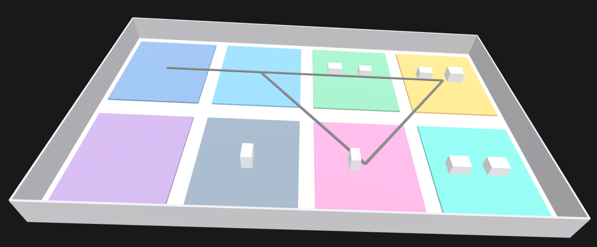
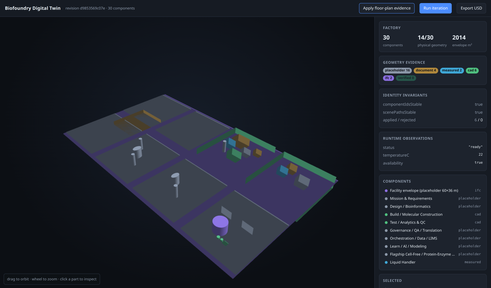
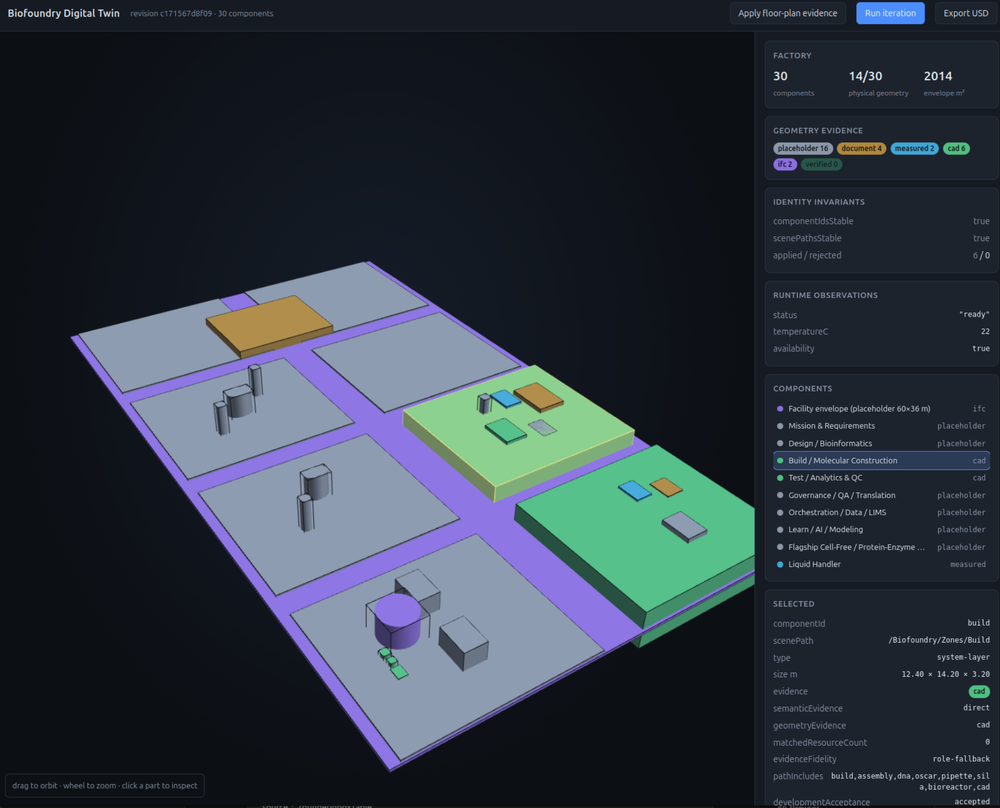
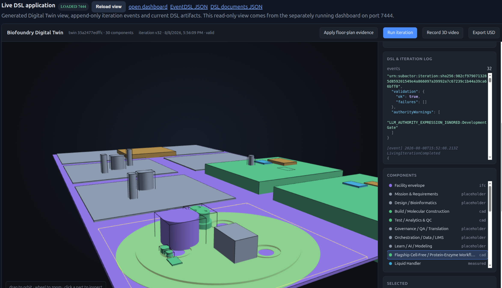
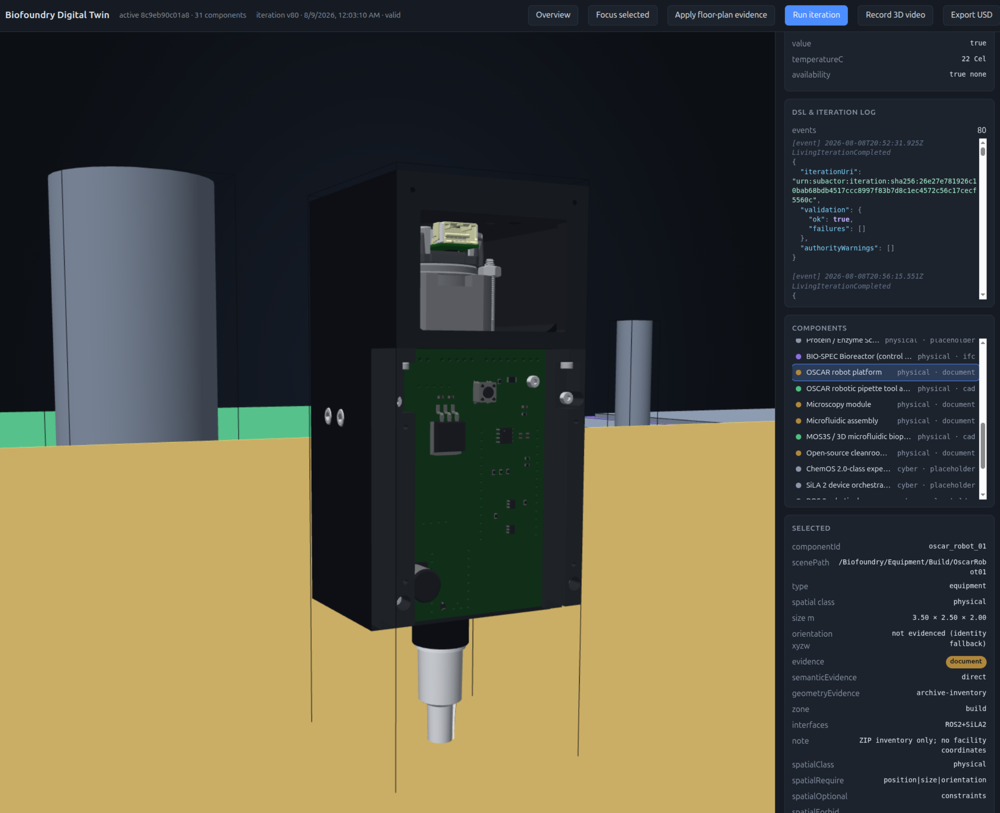
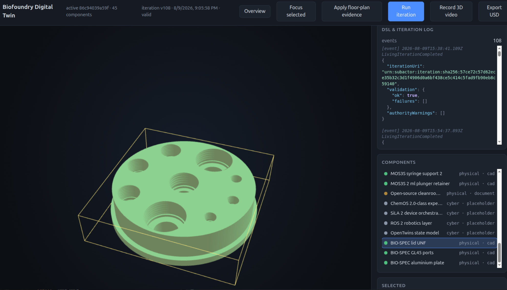
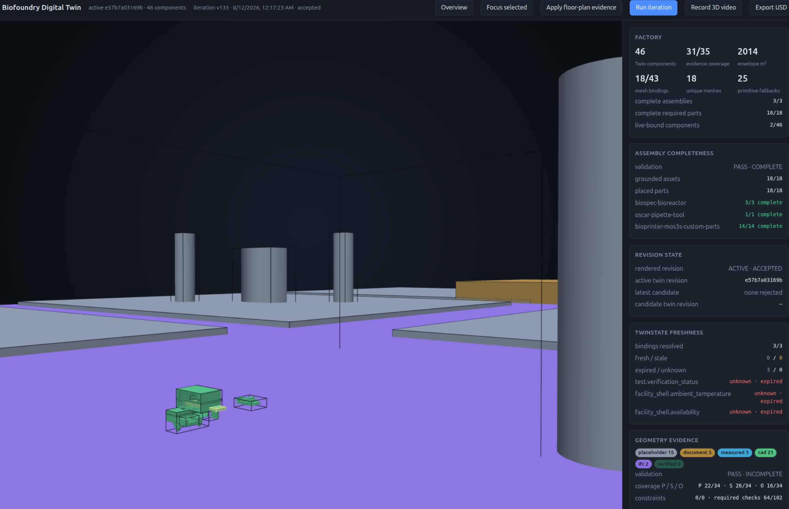

# Subactor Digital Twin Runtime Starter 0.5.4

## Iterations

### 1


### 2


### 3


### 4


### 5


### 6


### 7



Uruchamialny starter ciągłej, audytowalnej pętli Digital Twin:

```text
research: pliki / katalogi / ZIP / WWW → resourceDSL → treeDSL/queryDSL/mathDSL
    ↓
development: wymagania + kod + Git + testy → todo2code t2c.intent/v1 + diagnostics
    ↓
runtime: observationDSL → liveBindingDSL → TwinState (fresh/stale/expired/unknown) + event log
    ↓
structure: AssemblyDSL → device/part identity → grounded/placed/completeness report
    ↓
authority: deterministyczne bramki mathDSL + projectDSL + signed-grant policy
    ↓
Digital Twin: twinDSL → sceneDSL → OpenUSD
    ↓
feedback + improvementDSL → następna iteracja researchu i developmentu
```

System rozdziela trzy pętle:

1. **knowledge loop** — pozyskuje, adresuje i waliduje wiedzę;
2. **development loop** — porównuje intent z kodem, testami i Git;
3. **execution loop** — aktualizuje Twin i artefakty dopiero po twardych bramkach runtime.

`todo2code` pozostaje kanonicznym Intent Evidence DSL dla poleceń, planów, kodu, Git, dokumentacji i diagnostyki Intent vs Reality. Subactor AQL/OQL/URI Process pozostaje granicą authority i efektów. LLM może proponować DSL, ale nie definiuje bramek bezpieczeństwa i nie wywołuje executorów bezpośrednio.

## Co zmieniło się ostatnio

Najnowsze zmiany w 0.5.4 — pełna lista w [`CHANGELOG.md`](CHANGELOG.md):

- **Dashboard 3D** (`dashboard`): twin/scene po HTTP + własny renderer WebGL, bez zależności i bez build stepu;
- **Physical Evidence Intake** (`subactor.physical-evidence/v1`): geometria placeholder ustępuje faktom
  floor-plan/CAD/IFC/survey, a `componentId` i `scenePath` zostają te same;
- CLI `physical-intake` i `scene-render` (renderer OpenUSD nie miał wcześniej wejścia z CLI);
- **schema drift guard** — `schemas/*.json` i ręczne walidatory runtime muszą się zgadzać, inaczej testy padają;
- **f2md 0.2/0.3** wydzielone jako osobne paczki (`py/f2md`, `js/f2md`) z jedną wspólną kopertą proweniencji.
- **deterministic geometry compilation**: SCAD → OpenSCAD → canonical 3MF → GLB/USDA,
  content-addressed dependencies, receipts, reference-mesh validation and fail-closed Twin binding;
- **live state projection**: jawny `subjectUri + metric → componentId.property`, TTL, `observedAt`
  i `receivedAt`; stare dane pozostają dowodem, ale nie udają bieżącego stanu;
- **AssemblyDSL**: część nie może udawać całego urządzenia; runtime rozdziela ugruntowany asset,
  placement i kompletność oraz wystawia naprawialne URN/URI findings;
- **package boundaries**: AssemblyDSL oraz LiveBinding/TwinState są teraz niezależnie budowanymi,
  zero-dependency pakietami z testami kontraktowymi; `src/` zachowuje zgodne eksporty aplikacji.

W 0.5.1 doszedł Semantic Scene Blueprint (`subactor.scene-blueprint/v1`) ze stabilnymi ID komponentów,
domyślny blueprint Biofoundry Live v0.2.1 (30 komponentów) i most do concept twina.

Wcześniej (0.4.0) ustawione zostały fundamenty, które nadal obowiązują: twarde bramki `mathDSL`
generowane przez runtime i nienadpisywalne przez LLM, pierwszeństwo prawdziwego `todo2code` przed
fixture, egzekwowany limit iteracji, trwała dzierżawa projektu, failure receipts i dead-letter,
kopiowanie źródeł zewnętrznych do `imports/` oraz rzeczywisty `service-check`.

## Szybki start

Wymagany **Node 22+** (`package.json` → `engines`). Runtime buduje się i przechodzi `verify` również
na Node 20, ale wspieraną wersją jest 22.

```bash
npm install
npm run verify          # typecheck, proto, compose, testy, f2md conformance, wszystkie dema
npm run packages:test   # niezależne testy AssemblyDSL i LiveBinding/TwinState
```

Granice pakietów, ich odpowiedzialności i reguła kontraktów plikowych są opisane w
[`docs/PACKAGE_ARCHITECTURE.md`](docs/PACKAGE_ARCHITECTURE.md).

Test dystrybucji z gotowego `dist/`, bez kompilacji TypeScript:

```bash
npm run verify:dist
```

Usługi pomocnicze (ClickHouse + Docling) przez `make`:

```bash
make up            # tworzy .env, czeka na healthchecki, sonduje endpointy i uruchamia runtime doctor
make service-check # ponawia sondę ClickHouse + Docling z hosta
make logs
make down          # zatrzymuje, ale ZACHOWUJE wolumeny (modele Docling, dane ClickHouse)
make down-clean    # kasuje też wolumeny — kolejny start pobierze modele od nowa
```

Powtórny `make up` korzysta z cache BuildKit: pierwszy build obrazu Docling trwa kilkanaście minut,
kolejne kilka sekund.

### Usługi, porty i zmienne po `make up`

`make up` uruchamia ClickHouse i Docling, czeka aż ich healthchecki Compose przejdą, a następnie
sonduje oba endpointy z hosta przez `service-check`. Na końcu uruchamia jednorazowy job
`runtime doctor`, który sprawdza konfigurację runtime i jego połączenie z usługami. Po sukcesie
wypisuje te same adresy, które można wyświetlić ponownie poleceniem `make endpoints`:

| Usługa | Adres z hosta | Port kontenera | Zmienne `.env` |
| --- | --- | --- | --- |
| ClickHouse HTTP | `http://127.0.0.1:18123` | `8123` | `CLICKHOUSE_HTTP_PORT`, `CLICKHOUSE_URL`, `CLICKHOUSE_USER`, `CLICKHOUSE_PASSWORD` |
| ClickHouse native | `127.0.0.1:19000` | `9000` | `CLICKHOUSE_NATIVE_PORT` |
| Docling health/API | `http://127.0.0.1:15001/health` | `5001` | `DOCLING_PORT`, `DOCLING_URL` |
| Dashboard twina | `http://127.0.0.1:7331/` | — | **nie uruchamia go `make up`**; start: workspace `make dashboard PORT=7331` |

Sekcja `healthcheck` w Compose istnieje dla obu usług długotrwałych: ClickHouse (`/ping`) i
Docling (`/health`). `runtime` nie ma healthchecka, ponieważ nie jest serwerem — jego komenda
`doctor` kończy się powodzeniem albo błędem i jest wykonywana przez `make up` dopiero po zdrowym
stanie zależności.

Adresy hosta są domyślne i można je zmienić w `twin-dsl/.env` przed `make up`; po zmianie portu
ClickHouse ustaw zgodne `CLICKHOUSE_URL`. Dashboard nie jest kontenerem Compose. Uruchom go z
katalogu workspace przez `make dashboard`; nasłuchuje lokalnie na `127.0.0.1`.

`.env.example` jest katalogiem domyślnej konfiguracji runtime: zawiera integrację todo2code
(`T2C_*`), twin-probes (`TWIN_PROBES_*`), OpenRouter (`OPENROUTER_*`), usługi (`CLICKHOUSE_*`,
`DOCLING_*`, `COMPOSE_PROJECT_NAME`, `DT_NETWORK_SUBNET`) i zasady runtime (`DT_*`). Klucz
`OPENROUTER_API_KEY` jest opcjonalny — tryb `DT_LLM_MODE=deterministic` nie wysyła żądań do LLM.

## Konwersja dokumentów do Markdown

Do zasilania twina dokumentacją służy **[f2md](py/f2md)** — wyodrębniona paczka, publikowana jako
`f2md` na PyPI i `@subactor/f2md` na npm. Nie jest kolejnym uniwersalnym konwerterem: to warstwa
orkiestracji i śledzenia pochodzenia nad wymiennymi backendami (PyMuPDF, MarkItDown, Docling,
pdftotext/pandoc, Turndown/Mammoth). Pliki `.tex` są konwertowane przez Pandoc (`latex` →
Markdown), a gdy Pandoc nie jest dostępny, zachowywane jako blok źródłowy `tex`.

### Cały folder naraz

To jest sposób, w jaki powstał [`nanobionic-laboratory-md`](https://github.com/bioxfoundry/nanobionic-laboratory-md):

```bash
pip install 'f2md[pymupdf]'                 # rdzeń jest stdlib-only; PDF to opcjonalny extra
apt install poppler-utils pandoc            # dla PDF/Office bez Doclinga

make up                                     # opcjonalnie: Docling dla skanów i OCR

DOCLING_URL=http://127.0.0.1:15001 \
  f2md --tree ../nanobionic-laboratory ../nanobionic-laboratory-md \
       --secret-pattern 'konfidencial'
```

Struktura katalogów wyjścia odwzorowuje wejście **1:1**; główną projekcją jest plik Markdown:

```
nanobionic-laboratory/A/report.pdf
        ↓
nanobionic-laboratory-md/A/report.pdf.md
```

Od `f2md-quality-v1` kanonicznym modelem PDF jest `report.pdf.ast.json`
(`f2md.document-ast/v1`), a `report.pdf.md` jest wyłącznie jego projekcją. Towarzyszą mu
`report.pdf.structure.json`, `report.pdf.quality.mdqldsl` i `report.pdf.artifacts/` z manifestem,
ArtifactDSL, treeDSL, ArtifactQualityDSL oraz typed sidecarami tabel, kodu i figur. Sidecar
struktury zachowuje `page`, `bbox`, typ bloku, artifact URN i `semantic`; quality DSL rozróżnia `PASS`,
`DEGRADED` i `FAILED`. `f2md-intent` domyślnie kompiluje tylko `PASS` i wyłącznie bloki
`semantic=true`, więc nagłówki stron, numery, diagramowy OCR i treść niskiej jakości nie trafiają
do intentDSL. Jawne `--allow-degraded` służy wyłącznie do pracy z kandydatem i nie dopuszcza
`FAILED`. Pakiet Node deleguje formaty dokumentowe przez kopertę plikową do `python3 -m f2md.cli`;
gdy Python nie jest dostępny, jawnie wraca do lokalnych backendów zamiast udawać jakość kanoniczną.
W trybie drzewa figury trafiają do ArtifactStore jako oryginalne wycinki z SHA-256, a diagramy
ASCII są klasyfikowane przed tabelami. Brak natywnej warstwy tekstowej powoduje jawną odmowę
backendu layoutowego; OCR może wtedy wykonać wyłącznie backend zapisujący pełny audyt OCR.

Oryginalne rozszerzenie zostaje przed `.md`, więc nazwa nadal mówi, co ją wyprodukowało, a dwa
pliki różniące się tylko rozszerzeniem nigdy nie kolidują.

Przydatne opcje:

| opcja | działanie |
| --- | --- |
| `--only .pdf,.docx` | ogranicza przebieg do wybranych typów |
| `--quiet` | bez postępu per plik (postęp idzie na stderr, JSON na stdout) |
| `--secret-pattern REGEX` | pliki pasujące trafiają do `<nazwa>.secret.md` z `confidential: true` |
| `--docling-url URL` | dopina Docling jako ostatnie ogniwo (skany, tabele, OCR) |
| `--translate en` | wykrywa język i tłumaczy dokumenty spoza `en` |
| `--translation-policy` | `hybrid` (domyślnie), `argos`, `openrouter` |

Przebieg jest idempotentny — nadpisuje w miejscu — i odmawia zapisu wewnątrz katalogu źródłowego,
co inaczej podałoby wygenerowany Markdown na wejście kolejnego uruchomienia.

### Języki i tłumaczenie

`--translate en` wykrywa język każdego dokumentu i dla wszystkiego, co nie jest po angielsku,
zapisuje **oba** pliki:

```
Bendradarbiavimo_sutartis.docx.secret.lt.md   oryginał, oznaczony językiem
Bendradarbiavimo_sutartis.docx.secret.md      tłumaczenie na angielski
```

Nazwa bez sufiksu językowego to **zawsze** język docelowy, więc konsument, który chce „tę
angielską", może w ogóle nie znać kodów języków — a oryginał zostaje dostępny i wyraźnie opisany.
Konwersja przebiega w kolejności **format źródłowy → Markdown → tłumaczenie Markdown**; silnik
tłumaczący nie dostaje surowego LaTeX-a. Znaczniki nagłówków, list, tabel i bloków kodu są
chronione przed zmianą podczas tłumaczenia.

Silnik wybierany jest **per dokument**, nie per przebieg:

| polityka | dokumenty poufne | pozostałe |
| --- | --- | --- |
| `hybrid` *(domyślnie)* | `argos`, offline | `openrouter`, LLM w chmurze |
| `argos` | `argos` | `argos` |
| `openrouter` | **odmowa** | `openrouter` |

To jest sedno tej funkcji: tłumaczenie maszynowe dokumentu oznaczonego `KONFIDENCIALU` nie może go
wysłać do zewnętrznego dostawcy. `hybrid` trzyma takie pliki na silniku offline, a `openrouter`
**odmawia** ich zamiast po cichu obniżać wymagania — polityka, która może wyciec, nie jest polityką.

```bash
pip install 'f2md[translate]'   # argostranslate + detekcja języka, w pełni offline
export OPENROUTER_API_KEY=...   # tylko dla chmurowej połowy `hybrid`
```

Gdy silnik jest niedostępny, oryginał i tak powstaje, a brak zapisuje się jako `translationError`
w jego front matter — przebieg nigdy nie pada z powodu brakującego tłumacza.

### Co dostajesz w każdym pliku

Każdy plik ma front matter z pełną kopertą konwersji, więc pochodzenie przeżywa granicę katalogu:

```yaml
---
source: "/home/tom/github/bioxfoundry/nanobionic-laboratory/Saptera_Technologine_Kortele_Dark_Factory_v1.pdf"
sourceRelative: "Saptera_Technologine_Kortele_Dark_Factory_v1.pdf"
inputKind: ".pdf"
mediaType: "application/pdf"
confidential: true
converter: "pymupdf-layout"
converterVersion: "1.26.3"
backendType: "python"
ocr: false
ocrRequested: false
ocrActuallyUsed: false
ocrEngine: "none"
ocrVersion: "unknown"
ocrLanguages: []
ocrPages: []
fallbackDepth: 2
durationMs: 816
extractedChars: 7495
converted: true
qualityStatus: "degraded"
qualityScore: 84
structureArtifact: "Saptera_Technologine_Kortele_Dark_Factory_v1.pdf.structure.json"
qualityArtifact: "Saptera_Technologine_Kortele_Dark_Factory_v1.pdf.quality.mdqldsl"
sourceModel: "f2md.document-ast/v1"
documentAstArtifact: "Saptera_Technologine_Kortele_Dark_Factory_v1.pdf.ast.json"
artifactManifest: "Saptera_Technologine_Kortele_Dark_Factory_v1.pdf.artifacts/manifest.json"
warnings: []
---
```

Najważniejsze pola:

- **`source`** — ścieżka **absolutna** do oryginału, więc plik md wskazuje na źródło nawet po
  przeniesieniu czy opublikowaniu gdzie indziej; `sourceRelative` odwzorowuje układ drzewa;
- **`converter` / `converterVersion`** — który backend faktycznie zadziałał. Bez tego nie odróżnisz
  czystej ekstrakcji od zgadywanki OCR trzy kroki później;
- **`ocr`** — czy tekst powstał z rozpoznawania obrazu. W korpusie nanobionic **53 ze 146** plików
  przeszły OCR, co powinno ważyć na zaufaniu do ich treści;
- **`fallbackDepth`** — ile backendów odmówiło, zanim któryś wziął plik. Wysoka wartość na całym
  korpusie oznacza źle ustawioną kolejność łańcucha;
- **`warnings`** — obcięcie tekstu, utracone tabele, diagnostyka backendu. Straty są zapisane,
  a nie po cichu porzucone;
- **`backendType`** — `stdlib` / `binary` / `python` / `http`, czyli ile ta konwersja realnie kosztuje.

### Pliki bez warstwy tekstowej

Siatki CAD (STL, F3D, SCAD) i archiwa ZIP też dostają plik `.md` — z front matter i krótkim stubem
wyjaśniającym, dlaczego nie ma treści. Drzewo, które po cichu pomija pliki, nie zgadza się ze
źródłem, a to gorsze niż jawne „tu nie ma tekstu". W korpusie nanobionic to **33 ze 146** plików
(113 ma realnie wyekstrahowaną treść).

Rozkład backendów w tym korpusie — `pymupdf4llm` 66, `pandoc` 22, `deterministic-text` 16,
`docling` 9, brak (stub) 33 — czyli Docling odpowiada za skany, których nie wziął żaden tańszy backend.

### Pojedynczy plik

```bash
f2md notes.md                     # Markdown na stdout
f2md report.pdf --json            # pełna koperta jako JSON
f2md imports/report.pdf-9f2c8ad4  # nazwy content-addressed też działają
f2md scan.pdf --backend docling   # wymuszenie konkretnego backendu
f2md --detect *.pdf               # tylko wykryty typ i media type
```

Ten sam kontrakt w Node.js — `npx f2md --tree src/ out/`. Oba pakiety emitują identyczną kopertę;
`npm run f2md:conformance` pilnuje, żeby się nie rozjechały.

> **Parytet paczek.** Wspólne dla obu: `--tree`, `--only`, `--quiet`, `--json`, `--detect`,
> `--backend`, `--docling-url`. Tylko Python (`py/f2md`, obecnie 0.3.0): `--secret-pattern`,
> `--translate`, `--translation-policy`. Paczka npm (`@subactor/f2md`, 0.2.0) nie ma warstwy
> poufności ani tłumaczeń — korpus z polityką `KONFIDENCIALU` buduj Pythonem.

## Kreator żywego projektu

```bash
npm run build
node dist/src/cli/main.js project-create \
  "Customer Biofoundry" \
  ./projects/customer-biofoundry \
  biofoundry \
  "Aktualizuj zwalidowany Digital Twin na podstawie dokumentacji klienta, kodu i obserwacji runtime."

cd projects/customer-biofoundry
cp .env.example .env
```

Każdy projekt otrzymuje własne:

- `project.projectdsl` i projekcję JSON;
- katalogi manager/customer/project/archive/code/logs/environment/feedback;
- vendored, skompilowany runtime;
- osobny Docker Compose, sieć i wolumen ClickHouse;
- Docling, ClickHouse i watcher runtime;
- CI oraz release do GHCR;
- append-only event log, receipts, dead-letter, candidate i current artifacts;
- skrypt bootstrapujący kanoniczny `semcod/todo2code`.

Start usług:

```bash
docker compose up -d --build

docker compose run --rm runtime service-check
docker compose logs -f runtime
```

Jedna deterministyczna iteracja:

```bash
docker compose run --rm runtime \
  project-iterate /project/project.projectdsl /project/.living-runtime deterministic
```

Tryb ciągły:

```bash
docker compose run --rm runtime \
  project-watch /project/project.projectdsl /project/.living-runtime prefer-llm
```

## Dodawanie dowolnego źródła

Źródło spoza projektu jest kopiowane do kontrolowanego `imports/<role>/` i otrzymuje wpis proweniencji w `imports/manifest.jsonl`.

```bash
node vendor/runtime/dist/src/cli/main.js project-add-source \
  project.projectdsl customer /data/customer/specification.pdf

node vendor/runtime/dist/src/cli/main.js project-add-source \
  project.projectdsl archive /data/customer/materials.zip

node vendor/runtime/dist/src/cli/main.js project-add-source \
  project.projectdsl development /home/user/repositories/device-runtime

node vendor/runtime/dist/src/cli/main.js project-add-source \
  project.projectdsl runtime /var/log/device-observations
```

Strona WWW przez DQL/sitemap:

```bash
node vendor/runtime/dist/src/cli/main.js project-add-website \
  project.projectdsl https://docs.example.com \
  "bioreactor, calibration, safety"
```

Obsługiwane są pojedyncze pliki, katalogi, ZIP-y i DQL/sitemap. Pliki Office/PDF/obrazy mogą przechodzić przez Docling, a treści tekstowe mają deterministyczny fallback lokalny.

## Karmienie twina korpusem Markdown (przebieg zweryfikowany)

Ścieżka, którą warto stosować: najpierw `f2md` robi z binariów drzewo Markdown, potem to drzewo
zasila projekt. Korpus `nanobionic-laboratory-md` (18 MB) zamiast `nanobionic-laboratory` (1,4 GB)
oznacza szybszą iterację i pełną proweniencję w front matter każdego pliku.

```bash
node dist/src/cli/main.js project-create \
  "Nanobionic Laboratory MD" ../projects/nanobionic-laboratory-md biofoundry \
  "Buduj i ewoluuj walidowany Digital Twin open-source biofoundry na bazie korpusu Markdown."

P=../projects/nanobionic-laboratory-md/project.projectdsl
MD=../nanobionic-laboratory-md

# katalogi tematyczne → role
node dist/src/cli/main.js project-add-source "$P" customer "$MD/A. SPECIFIKACIJA"
node dist/src/cli/main.js project-add-source "$P" project  "$MD/0. Architecture"
node dist/src/cli/main.js project-add-source "$P" project  "$MD/0. OSCAR robot"
node dist/src/cli/main.js project-add-source "$P" project  "$MD/I. Bioreactor"
# … II. Microscopy, III. Microfluidic assembly, IV. 3D microfluidic bioprinting,
#    V. Opensource clean room, C. Biofoundry article

# pojedyncze dokumenty najwyższego poziomu
node dist/src/cli/main.js project-add-source "$P" project "$MD/nanobionic_lab_whitepaper.pdf.md"
node dist/src/cli/main.js project-add-source "$P" manager "$MD/LMT_Nanobiobot_Paraiskas_2026_EN.docx.md"

node dist/src/cli/main.js project-verify  "$P"
node dist/src/cli/main.js project-iterate "$P" ../projects/nanobionic-laboratory-md/.living-runtime deterministic
```

Dodawaj **podkatalogi**, nie sam korzeń: `project-add-source` kopiuje rekurencyjnie, więc korzeń
wciągnąłby też `.git` (tu 9,3 MB) do `imports/`.

Wynik jednej iteracji na tym korpusie — **30/30 komponentów uziemionych** w realnych zasobach, żaden
nie spadł na `role-fallback`:

| dowód semantyczny | komponenty |
| --- | --- |
| `semantic+path` (dopasowanie po ścieżce) | 17 |
| `semantic` | 13 |
| `role-fallback` (filtr nic nie złapał) | 0 |

Kilka przykładowych trafień: `build` 51 zasobów, `enzyme_screen_01` 66, `flagship_cellfree_enzyme` 35,
`biospec_bioreactor_01` 35 (w tym 19 plików CAD), `cleanroom_base_01` 1.

Nazewnictwo `f2md` (`<oryginał>.<ext>.md`) jest tu istotne: `lid_UNF.step.md` nadal mówi, że pod
spodem jest STEP, więc `pathIncludes` w blueprint trafiają tak samo jak na korpusie binarnym.
Routing konwertera patrzy jednak na **końcowy** znany format: `report.pdf.md` jest już Markdownem
i nie trafia ponownie do `pdftotext`; dla `report.pdf.md-<hash>` wybierany jest najbardziej
prawostronny znany sufiks (`.md`). Dzięki temu nazwa zachowuje provenance bez ponownej konwersji.
Jeden wyjątek — patrz [Naprawione defekty](#naprawione-defekty).

## NL → wszystkie DSL

Obsługiwane `kind`:

```text
intent resource query dql tree math twin scene project observation improvement
```

```bash
export OPENROUTER_API_KEY="..."
export OPENROUTER_MODEL="mistralai/codestral-2508"

node dist/src/cli/main.js nl-to-dsl \
  improvement request.md out/improvement.json require-llm
```

Tryby:

```text
deterministic
prefer-llm
require-llm
```

Alias CLI `llm` oznacza bezpieczne `prefer-llm`. Dla słabszych modeli ustaw
`DT_LLM_RESOURCE_CONTEXT_LIMIT` (domyślnie 80) oraz budżet `OPENROUTER_TIMEOUT_MS`; po błędzie lub
timeout `prefer-llm` publikuje wyłącznie zwalidowany fallback deterministyczny i zapisuje
`degraded/reason` w `generation-audit.json`.

Granica wykonawcza:

```text
NL
→ LLM_POLICY + LLM_CONTEXT (target schema + patch schema + GGML GBNF + hash bazy)
→ OpenRouter: wyłącznie subactor.patch-envelope/v1 z patchDSL
→ lokalny parser patchDSL (target/hash/capability/JSON Pointer)
→ deterministyczne zastosowanie patcha do kopii stanu bazowego
→ lokalna pętla parsera domenowego (błąd wraca jako LLM_REPAIR DSL)
→ canonical DSL AST
→ walidacja domenowa
→ hash
→ projectDSL/AQL authority
→ runtime
```

Po materializacji runtime współpracuje wyłącznie przez kontrakty DSL i URI. Natural language nie jest przekazywany do executorów.
Ta sama granica obowiązuje tłumaczenie i kompilację intencji w Pythonowym `f2md`, advisory
`diagnose-agent` oraz propozycje diffów `repair-agent`; żaden z tych klientów nie akceptuje już
surowej prozy ani gotowego artefaktu jako odpowiedzi modelu.

## Aktualny poziom autonomii

Zaimplementowano ciągłą autonomię modelu i sceny **w obrębie zatwierdzonego `projectDSL`**:

- obserwowanie i inkrementalne snapshoty;
- development evidence z `todo2code`;
- obserwacje środowiskowe;
- deterministyczne bramki authority;
- publikacja wyłącznie zielonej sceny;
- last-known-good;
- idempotentne `noChange`;
- rate limiting;
- persistent lease;
- failure receipts i dead-letter;
- propose-only plan doskonalenia.

Samomodyfikacja źródeł runtime pozostaje wyłączona domyślnie:

```text
POLICY_ALLOW_RUNTIME_SELF_MODIFICATION false
POLICY_AUTONOMY_MODE propose
POLICY_REQUIRE_SIGNED_MUTATION_GRANT true
```

## Historia zdarzeń (plan / wykonanie / autonomia)

Pełny rejestr tego, co zaplanowano i wykonano w sesji operacyjnej oraz co działa dalej w pętli autonomicznej:

- [`docs/EVENT_HISTORY_AUTONOMY.md`](docs/EVENT_HISTORY_AUTONOMY.md)

## Mutacja kodu (0.5.0)

```bash
export MUTATION_GRANT_HMAC_SECRET="replace-me"
node dist/src/cli/main.js grant-issue <projectId> <planHash> <artifactSha256> code/ manager@example.com grant.json
node dist/src/cli/main.js mutation-propose project.projectdsl plan.json .living-runtime
```

Apply jest opcjonalny, wymaga `POLICY_AUTONOMY_MODE apply`, `POLICY_ALLOW_RUNTIME_SELF_MODIFICATION true`, skonsumowanego grantu i `approval-hash`; zapisuje wyłącznie w izolowanym worktree/katalogu.

Evidence z `subactor/twin-probes`:

```bash
# Run the sibling checkout directly from source (no package publication/build required).
export TWIN_PROBES_ROOT=/path/to/subactor/twin-probes
node dist/src/cli/main.js probes-run . cycle.json twin-dsl src

# Or ingest an existing cycle.
node dist/src/cli/main.js probes-ingest cycle.json .living-runtime/candidate/probe.evidence.json
```

Pełna autonomia kodu wymaga jeszcze promocji z izolacji do drzewa głównego, canary/rollback (`autonomy-lab`), niezależnego evaluatora, trwałego event store i walidacji geometrii.

## Weryfikacja

```bash
npm run verify
```

Ostatni pełny przebieg: **exit 0, 95/95 testów Node**, 12 kontraktów Proto, 4 fixture f2md zgodne
co do koperty, wszystkie dema zielone.

Sprawdzone lokalnie:

- TypeScript strict;
- 12 kontraktów Proto z kontrolą duplikatów numerów pól;
- 95/95 testów Node (`node --test dist/test/*.test.js`);
- NL → 11 DSL;
- OpenRouter strict structured-output mock;
- DQL sitemap/context;
- foldery, ZIP i import ścieżek zewnętrznych;
- Biofoundry real-time;
- adapter procesu `todo2code`;
- generator izolowanego projektu;
- pełny living loop;
- ochrona authority przed LLM;
- fixture policy, rate limit i persistent lease;
- improvementDSL, failure receipts i dead-letter;
- prawdziwe żądania testowe do mocków ClickHouse i Docling;
- kontrakty Docker Compose i CI/CD.

W środowisku przygotowania paczki nie ma binarnego Dockera ani demona. `docker compose up`, budowa obrazów i sieciowa integracja prawdziwych kontenerów nie zostały wykonane lokalnie. Workflow `Docker Integration` uruchamia tę brakującą bramę na `ubuntu-latest`, w tym `runtime service-check`.

## Od placeholdera do fizycznego twina

Geometria startuje jako jawny placeholder i twardnieje, gdy pojawią się realne dane — **bez zmiany
tożsamości komponentu**. To kontrakt, na którym opiera się cała ścieżka:

```
componentId  zostaje ten sam
scenePath    zostaje ten sam
zmienia się tylko reprezentacja fizyczna i jej pochodzenie
```

Dzięki temu `liquid_handler_01` przechodzi `placeholder → measured → cad → ifc → verified`, zamiast
stać się pięcioma różnymi urządzeniami. Szczegóły: [`docs/PHYSICAL_EVIDENCE_INTAKE.md`](docs/PHYSICAL_EVIDENCE_INTAKE.md).

```bash
# szablon do wypełnienia
cp physical-intake/templates/physical-evidence.template.json baseline/physical-evidence.json

# nałożenie na istniejącą parę twin/scene
node dist/src/cli/main.js physical-intake twin.json scene.json baseline/physical-evidence.json

# trwale: wpięcie w projekt (wchodzi do hasha konfiguracji, więc wymusza nową rewizję)
echo 'SCENE_PHYSICAL_EVIDENCE_FILE "baseline/physical-evidence.json"' >> project.projectdsl
```

Intake odrzuca dane, które łamałyby kontrakt: nieznany `componentId`, dowód słabszy niż istniejący,
plik siatki spoza zaingestowanego korpusu, jednostki inne niż metry.

```bash
npm run demo:physical   # pełny przebieg end-to-end, wywala build gdy tożsamość się zmieni
```

## Dashboard 3D

### Diagnostyka całego przepływu

`project-diagnose` skanuje źródłowe CAD, ich lustro Markdown, pakiety intentDSL oraz artefakty
żywego runtime (`twin.json`, `scene.json`, evidence i generation audit). Wynik ma stabilne kody
`urn:subactor:diagnostic:<code>:sha256:<hash>` oraz URI procesów naprawczych
`subactor://process/repair/digital-twin/...`. Diagnostyka jest deterministyczna i nie pozwala
LLM zmienić bramek authority; OpenRouter służy wyłącznie do opcjonalnych propozycji naprawy.

```bash
npm run build
node dist/src/cli/main.js project-diagnose \
  /home/tom/github/bioxfoundry/nanobionic-laboratory \
  /home/tom/github/bioxfoundry/nanobionic-laboratory-md \
  /home/tom/github/bioxfoundry/nanobionic-laboratory-md-dsl \
  /home/tom/github/bioxfoundry/projects/nanobionic-laboratory-md/.living-runtime
```

Raport jest zapisywany domyślnie jako `current/digital-twin-diagnostics.json`. Aktualne URI
napraw wskazują m.in. tessellację CAD do glTF, ponowne generowanie sceny, naprawę evidence i
ponowienie konwersji Docling. Lokalny `.env` jest automatycznie ładowany (bez nadpisywania
zmiennych środowiskowych), więc `doctor` pokazuje aktywny model OpenRouter bez ujawniania klucza.

### Katalog błędów

Każdy statyczny kod emitowany przez runtime, dashboard, adaptery i lokalne pakiety JavaScript ma
wpis w [`error/catalog.json`](error/catalog.json) oraz generowaną stronę
[`error/<KOD>.md`](error/README.md). `npm run errors:check` porównuje katalog ze źródłami i blokuje
kod bez objaśnienia, osierocony wpis albo ręcznie zmienioną stronę. Znaczenie zmienia się wyłącznie
w katalogu; `npm run errors:docs` odtwarza projekcje Markdown. Nowe kody mają stałą postać
`UPPER_SNAKE_CASE`; zmienne dane (ścieżka, status HTTP, identyfikator) trafiają dopiero po
dwukropku, więc nie tworzą osobnych kodów. Opublikowane wcześniej kody `mutation_grant_*`
pozostają w dotychczasowej postaci i również podlegają kontroli katalogu.

Dashboard rozpoznaje kod z odpowiedzi serwera i pokazuje kartę z jego znaczeniem, możliwymi
przyczynami oraz rozwiązaniem. Ten sam kontrakt jest dostępny jako JSON pod
`/api/errors/<KOD>` i jako Markdown pod `/error/<KOD>.md`; odpowiedzi błędów zawierają oba
odnośniki. Katalog oraz strony są kopiowane również do vendored runtime i obrazu kontenera.

### CAD/SCAD → executable geometry

`scripts/cad-to-gltf.py` konwertuje binary/ASCII STL, 3MF oraz OBJ+MTL do walidowalnego GLB.
OBJ zachowuje indeksy, grupy i materiały jako osobne glTF primitives/PBR materials. Jeżeli
`CADQUERY_PATH` wskazuje środowisko CadQuery/OCP, STEP jest importowany przez OpenCascade.
SCAD ma osobny, wykonywalny kontrakt `subactor.geometry-build/v1`: prawdziwy OpenSCAD generuje
kanoniczny 3MF, z którego runtime tworzy GLB i USDA oraz receipt. F3D nadal wymaga jawnego
backendu — nie jest udawany jako geometria.

```bash
CADQUERY_PATH=/path/to/cadquery-deps python3 scripts/cad-to-gltf.py \
  <source-cad-root> <derived-geometry-root> --source-unit millimeter \
  --report cad-tessellation.report.json

node dist/src/cli/main.js geometry-build \
  ../nanobionic-laboratory-md-dsl/geometry/lid-unf.geometry-build.json \
  .geometry-build nanobionic-laboratory-md
```

STL i OBJ nie deklarują jednostki, dlatego konwersja odmawia pracy bez `--source-unit`.
STEP jest normalizowany z kanonicznej jednostki CadQuery (mm), a 3MF korzysta z jednostki
zapisanej w samym dokumencie. Wszystkie pozycje GLB są emitowane w metrach wymaganych przez glTF.

Dashboard ładuje zarówno STL, jak i GLB (`loadGlb`), a URI GLB jest sprawdzany przez te same
bramki zasobów co pozostałe evidence. Nieudany receipt pozostaje widoczny w candidate DSL/logach,
ale nie zastępuje ostatniej poprawnej sceny. Szczegóły i rzeczywisty wynik lid_UNF:
[`docs/GEOMETRY_COMPILATION.md`](docs/GEOMETRY_COMPILATION.md).

### ZIP project evidence → geometry candidates

`archive-analyze` skanuje całe projekty zapisane w ZIP, wykrywa assembly/part CAD, mesh, BOM,
dokumentację, firmware, konfigurację i materiały, a następnie tworzy ograniczony plan ekstrakcji.
Nie wykonuje kodu z archiwum i nie pozwala, aby wpis ZIP został uznany za fizyczny mesh przed
materializacją, hashowaniem, konwersją i receipt. Duży ChemOS (3552 wpisy) jest analizowany zamiast
odrzucany przez historyczny limit 1000 plików.

```bash
node dist/src/cli/main.js archive-analyze <zip-or-directory> <out-dir> analyze
node dist/src/cli/main.js archive-analyze <zip-or-directory> <out-dir> materialize
```

Kontrakty, metryki, bezpieczeństwo oraz wynik dla 9 archiwów nanobionic-laboratory opisuje
[`docs/ARCHIVE_PROJECT_EXTRACTION.md`](docs/ARCHIVE_PROJECT_EXTRACTION.md).

Podgląd żywego twina w przeglądarce — bez zależności, własny renderer WebGL:

```bash
node dist/src/cli/main.js dashboard <project.projectdsl> <runtime-out-dir> [port] [mode]
# domyślnie http://127.0.0.1:7331/, tryb deterministic
```

W workspace uruchom `make dashboard` (opcjonalnie `PORT=7444`): Makefile poczeka na gotowość
serwera i otworzy URL w domyślnej przeglądarce przez systemowy handler. Gdy przeglądarka już
działa, standardowy handler zwykle otwiera nową kartę; jej dokładne zachowanie pozostaje
kontrolowane przez system i ustawienia przeglądarki. Proces dashboardu pozostaje aktywny w
terminalu — zakończ go `Ctrl+C`. Preflight portu ponownie używa zdrowej instancji tylko wtedy,
gdy jej aktywny Twin należy do żądanego projektu. Inny projekt lub inna usługa na tym porcie
daje `DASHBOARD_PORT_CONFLICT` z identyfikatorami `expected` i `actual`; wybierz wtedy inny
`PORT` albo uruchom dashboard właściwego projektu z jego katalogu workspace.

W checkoutcie osadzonym w workspace `make dashboard` automatycznie wybiera pełny projekt
`../projects/nanobionic-laboratory-md`, zamiast ograniczonego demonstratora. Dzięki temu ten sam
skrót uruchomiony z katalogu `twin-dsl` zachowuje wszystkie 45 komponentów i ich fizyczne
bindingi. Jawne `make dashboard-demo` uruchamia 30-elementowy `.factory-demo`; w samodzielnym
checkoutcie bez sąsiedniego projektu jest on również bezpiecznym fallbackiem. Przed startem
demonstratora migrator odświeża tylko kanoniczny blueprint `biofoundry-live-*` i nigdy nie
nadpisuje projektu niestandardowego.

Kolor koduje **stopień dowodu geometrycznego**, nie typ komponentu, więc widać, jak fabryka
twardnieje w miarę napływu danych: szary `placeholder`, bursztynowy `document`, niebieski
`measured`, zielony `cad`, fioletowy `ifc`, miętowy `verified`. Obok sceny raportowane są
niezmienniki tożsamości (`componentIdsStable`, `scenePathsStable`).

Endpointy: `/api/state`, `/api/dsl`, `/api/scene.usda` (eksport OpenUSD),
`/api/errors/<KOD>`, `/error/<KOD>.md`, `POST /api/iterate`, `POST /api/intake`. Zablokowana
iteracja zwraca HTTP 422 z dokładną listą failures; browser i server console pokazują ten sam
stabilny kod zamiast ogólnego „iteration failed”.

> Usługa **nie ma uwierzytelniania ani ochrony CSRF**, a `/api/iterate` i `/api/intake` modyfikują
> projekt na dysku. Słucha tylko na `127.0.0.1` — to narzędzie do lokalnej inspekcji, nie wystawiaj
> go na publiczny interfejs. Szczegóły: [`docs/DASHBOARD.md`](docs/DASHBOARD.md).

> `POST /api/intake` **scala** rekordy z tym, co projekt już trzyma, i zapisuje wyłącznie to,
> co przeszło walidację. Dokument, z którego nic nie zostało przyjęte, zwraca **422** i nie
> zapisuje nic. Szczegóły: [Naprawione defekty](#naprawione-defekty).

## Naprawione defekty

Trzy defekty znalezione przebiegiem na korpusie `nanobionic-laboratory-md` — nie z lektury
kodu — są **naprawione i zapięte testami regresji**. Opis zostaje, bo sposób, w jaki się
ujawniły, mówi więcej niż sama łatka.

### 1. Intake nadpisywał plik dowodów, zanim go zweryfikował (utrata danych)

`POST /api/intake` zapisywał `baseline/physical-evidence.json` **w całości**, a dopiero potem
uruchamiał iterację stosującą regułę „słabszy dowód nie nadpisuje mocniejszego". Reguła
działała więc *wewnątrz* jednego dokumentu, ale nie *pomiędzy* dokumentami.

Zaobserwowany przebieg: po intake, który podniósł 6 komponentów, kolejny intake z jednym
rekordem i nieuziemionym `assetUri` został odrzucony (`applied: []`) — ale plik już był
podmieniony, więc **wszystkie 6 komponentów wróciło do `placeholder`**, przy odpowiedzi 200.

**Naprawa** (`src/serve/dashboard.ts`): dokument jest oceniany **osobno** względem żywego
twina, na dysk trafiają **tylko rekordy przyjęte**, scalone po `componentId` z tym, co projekt
już trzymał. Pre-check dostaje `allowedAssetUris` z `current/resources.json`, więc
`ASSET_NOT_GROUNDED` wychodzi **przed** zapisem. Intake, z którego nic nie przeszło, zwraca
**422** i nie zapisuje nic.

Weryfikacja na żywej usłudze — ten sam dokument, który wcześniej niszczył bazę:

```
HTTP 422   error: PHYSICAL_EVIDENCE_REJECTED
           rejected: [{ componentId: liquid_handler_01, reason: ASSET_NOT_GROUNDED }]
facility_shell ifc → ifc     build cad → cad     test cad → cad     (bez zmian)
```

A akumulacja działa: kolejny poprawny rekord podniósł `analytics_01` do `measured`
i baza urosła do 11 rekordów, nie tracąc żadnego.

### 2. `cadAssetCount` nie widział rozszerzeń w korpusie f2md

Wyrażenie w `src/scene/blueprint.ts` było zakotwiczone na końcu nazwy, a w korpusie f2md każdy
plik kończy się na `.md` — liczyła się więc tylko przypadkowa obecność słowa `cad` w ścieżce.
`bioprinter_mos3s_01` miał `cadAssetCount: undefined` mimo 14 części `*.stl.md`.

**Naprawa**: opcjonalny sufiks `(\.[a-z]{2})?(\.md)?` na końcu wzorca. Po iteracji:
`bioprinter_mos3s_01` 14, `microfluidic_assembly_01` 14, `biospec_bioreactor_01` 19.
Test pokrywa korpus binarny i mirror Markdown obok siebie oraz pilnuje, żeby proza
(`installation-steps.md`) nie została uznana za geometrię.

### 3. `label` nie starzał się razem z geometrią

`applyPhysicalEvidence` aktualizował `geometryEvidence`, `position` i `size`, ale nie `label`,
więc dashboard pokazywał plakietkę `ifc` obok podpisu „Facility envelope (**placeholder
60×36 m**)" przy faktycznym 58,2 × 34,6 m.

**Naprawa**: przy dowodzie mocniejszym niż `placeholder` z etykiety znika sam nawias
z deklaracją placeholdera; nazwa komponentu zostaje. `label` nie jest tożsamością —
`componentId` i `scenePath` nią są — więc przepisanie go nie narusza kontraktu intake'u.

### 4. Drobiazgi

- **Wyścig na `/api/intake`**: `busy` jest teraz zajmowane **przed** pierwszym `await`,
  więc dwa równoległe żądania nie przechodzą już obu przez bramkę.
- **`alert()`** zastąpiony nieblokującym paskiem statusu w nagłówku. Modal zamrażał pętlę
  zdarzeń, co zatrzymywało odświeżanie co 5 s i każdą automatyzację sterującą stroną.
- **`engines`** poprawione na `>=20.19` — `verify` przechodzi na Node 20, więc deklaracja
  `>=22` była ostrzejsza niż faktyczne wymaganie.

### 5. Naprawa nie docierała do istniejących projektów

Ujawnione przy naprawianiu punktu 2: iteracja jest pomijana (`noChange`), gdy nie zmieniły się
**wejścia** — źródła, kod, obserwacje, konfiguracja. Runtime nie był częścią tego klucza, więc
naprawa semantyki generowania **nigdy nie docierała** do istniejącego twina: łatka wchodziła,
wszystkie hashe zostawały te same, a twin dalej trzymał wartości ze starego kodu.

**Naprawa** (`src/core/generation.ts`): `RUNTIME_GENERATION` wchodzi do klucza pomijania.
Bump przy zmianie tego, co runtime **wyprowadza** z niezmienionych wejść — reguł uziemienia,
dopasowania blueprintu, rankingu dowodów, układu sceny — i każdy projekt przelicza się przy
najbliższej iteracji. `DT_FORCE_ITERATION=1` wymusza przeliczenie bez bumpa.

To jest warunek konieczny sprzężenia zwrotnego: bez tego autonomiczna pętla nigdy nie
zobaczyłaby własnej poprawki.

## Przykłady

```bash
npm run demo
npm run demo:nl-dsl
npm run demo:research
npm run demo:biofoundry
npm run demo:realtime
npm run demo:living
npm run demo:physical
npm run demo:autonomy
npm run demo:mutation
```

Najważniejsze materiały:

- `examples/autonomy/README.md`
- `examples/biofoundry/`
- `examples/researcher/`
- `examples/nl-to-dsl/`
- `VERIFICATION.md`

## Dokumentacja

| dokument | o czym |
| --- | --- |
| [`docs/ARCHITECTURE.md`](docs/ARCHITECTURE.md) | podział na warstwy i granice authority |
| [`docs/CONTINUOUS_DIGITAL_TWIN_LOOP.md`](docs/CONTINUOUS_DIGITAL_TWIN_LOOP.md) | pełna pętla research → runtime → twin |
| [`docs/DSL_SPEC.md`](docs/DSL_SPEC.md) | składnia wszystkich DSL |
| [`docs/SEMANTIC_SCENE_BLUEPRINT.md`](docs/SEMANTIC_SCENE_BLUEPRINT.md) | blueprint: tożsamość vs stan |
| [`docs/PHYSICAL_EVIDENCE_INTAKE.md`](docs/PHYSICAL_EVIDENCE_INTAKE.md) | placeholder → measured → cad → ifc → verified |
| [`docs/GEOMETRY_COMPILATION.md`](docs/GEOMETRY_COMPILATION.md) | SCAD → 3MF/GLB/USD, geometryDSL, receipts and validation |
| [`docs/DIGITAL_TWIN_DETAIL_AUDIT.md`](docs/DIGITAL_TWIN_DETAIL_AUDIT.md) | measured detail/render-fidelity gaps, repair URIs and acceptance gates |
| [`docs/DASHBOARD.md`](docs/DASHBOARD.md) | dashboard 3D, endpointy, model bezpieczeństwa |
| [`docs/PROJECT_WIZARD.md`](docs/PROJECT_WIZARD.md) | generator izolowanego projektu |
| [`docs/QUICK_SOURCE_RECIPES.md`](docs/QUICK_SOURCE_RECIPES.md) | przepisy na dodawanie źródeł |
| [`docs/DQL_PROFILES.md`](docs/DQL_PROFILES.md) | profile crawlera DQL/sitemap |
| [`docs/OPENROUTER_NL_TO_DSL.md`](docs/OPENROUTER_NL_TO_DSL.md) | NL → DSL przez structured output |
| [`docs/TODO2CODE_INTEGRATION.md`](docs/TODO2CODE_INTEGRATION.md) | Intent vs Reality, adapter `todo2code` |
| [`docs/REALTIME_BIOFOUNDRY.md`](docs/REALTIME_BIOFOUNDRY.md) | watcher czasu rzeczywistego |
| [`docs/RESEARCHER_WORKFLOWS.md`](docs/RESEARCHER_WORKFLOWS.md) | ścieżki badawcze |
| [`docs/AUTONOMY_MODEL.md`](docs/AUTONOMY_MODEL.md) · [`AUTONOMY_EXAMPLES.md`](docs/AUTONOMY_EXAMPLES.md) · [`AUTONOMY_FINDINGS.md`](docs/AUTONOMY_FINDINGS.md) | model autonomii, przykłady, wnioski |
| [`docs/FULL_AUTONOMY_GAPS.md`](docs/FULL_AUTONOMY_GAPS.md) | czego brakuje do pełnej autonomii kodu |
| [`docs/EVENT_HISTORY_AUTONOMY.md`](docs/EVENT_HISTORY_AUTONOMY.md) | rejestr planu i wykonania |
| [`docs/GITHUB_AND_CI.md`](docs/GITHUB_AND_CI.md) · [`CI_CD.md`](docs/CI_CD.md) | CI/CD i release |
| [`docs/TEST_PLAN.md`](docs/TEST_PLAN.md) | zakres testów |


## License

Licensed under Apache-2.0.
