# System Architecture Analysis
<!-- generated in 0.00s -->

## Overview

- **Project**: /home/tom/github/bioxfoundry/twin-dsl
- **Primary Language**: json
- **Languages**: json: 44, typescript: 41, proto: 12, javascript: 7, yaml: 4
- **Analysis Mode**: static
- **Total Functions**: 556
- **Total Classes**: 81
- **Modules**: 119
- **Entry Points**: 424

## Architecture by Module

### src.runtime.living-project
- **Functions**: 100
- **Classes**: 1
- **File**: `living-project.ts`

### src.runtime.autonomy
- **Functions**: 53
- **Classes**: 2
- **File**: `autonomy.ts`

### src.runtime.mutation-grant
- **Functions**: 43
- **Classes**: 1
- **File**: `mutation-grant.ts`

### src.project.wizard
- **Functions**: 43
- **Classes**: 1
- **File**: `wizard.ts`

### src.runtime.mutation-pipeline
- **Functions**: 28
- **Classes**: 2
- **File**: `mutation-pipeline.ts`

### src.runtime.biofoundry
- **Functions**: 23
- **Classes**: 6
- **File**: `biofoundry.ts`

### src.adapters.todo2code
- **Functions**: 23
- **Classes**: 3
- **File**: `todo2code.ts`

### src.adapters.twin-probes
- **Functions**: 19
- **Classes**: 5
- **File**: `twin-probes.ts`

### src.research.crawler
- **Functions**: 18
- **Classes**: 3
- **File**: `crawler.ts`

### src.llm.openrouter
- **Functions**: 18
- **Classes**: 3
- **File**: `openrouter.ts`

### src.dsl.math
- **Functions**: 17
- **File**: `math.ts`

### src.runtime.isolated-worktree
- **Functions**: 15
- **Classes**: 1
- **File**: `isolated-worktree.ts`

### src.cli.main
- **Functions**: 14
- **File**: `main.ts`

### src.runtime.living-watcher
- **Functions**: 12
- **Classes**: 1
- **File**: `living-watcher.ts`

### src.dsl.improvement
- **Functions**: 11
- **File**: `improvement.ts`

### src.runtime.service-check
- **Functions**: 11
- **Classes**: 1
- **File**: `service-check.ts`

### src.dsl.observation
- **Functions**: 9
- **File**: `observation.ts`

### src.llm.dsl-schemas
- **Functions**: 9
- **File**: `dsl-schemas.ts`

### scripts.demo-autonomy
- **Functions**: 9
- **File**: `demo-autonomy.mjs`

### src.adapters.clickhouse
- **Functions**: 8
- **Classes**: 4
- **File**: `clickhouse.ts`

## Key Entry Points

Main execution flows into the system:

### src.cli.main.main
- **Calls**: src.cli.main.slice, src.cli.main.Todo2CodeAdapter, src.cli.main.TwinProbesAdapter, src.cli.main.OpenRouterStructuredClient, src.cli.main.log, src.cli.main.stringify, src.cli.main.available, src.cli.main.configured

### src.runtime.biofoundry.BiofoundryRuntime.build
- **Calls**: src.runtime.biofoundry.resolve, src.runtime.biofoundry.dirname, src.runtime.biofoundry.Error, src.runtime.biofoundry.map, src.runtime.biofoundry.scanSources, src.runtime.biofoundry.parseDql, src.runtime.biofoundry.readFile, src.runtime.biofoundry.String

### src.research.researcher.runResearcherDemo
- **Calls**: src.research.researcher.mkdir, src.research.researcher.parse, src.research.researcher.readFile, src.research.researcher.join, src.research.researcher.fixtureFetch, src.research.researcher.parseDql, src.research.researcher.DqlCrawler, src.research.researcher.crawl

### src.research.crawler.DqlCrawler.crawl
- **Calls**: src.research.crawler.shift, src.research.crawler.URL, src.research.crawler.includes, src.research.crawler.toLowerCase, src.research.crawler.Error, src.research.crawler.networkGuard, src.research.crawler.fetchText, src.research.crawler.toString

### src.runtime.pipeline.runDemo
- **Calls**: src.runtime.pipeline.mkdir, src.runtime.pipeline.DeterministicMarkdownConverter, src.runtime.pipeline.InMemorySearchProjection, src.runtime.pipeline.readdir, src.runtime.pipeline.join, src.runtime.pipeline.convert, src.runtime.pipeline.resourceFromText, src.runtime.pipeline.push

### src.project.wizard.addProjectSource
- **Calls**: src.project.wizard.resolve, src.project.wizard.dirname, src.project.wizard.parseProjectDsl, src.project.wizard.readFile, src.project.wizard.exists, src.project.wizard.Error, src.project.wizard.relative, src.project.wizard.startsWith

### src.runtime.mutation-pipeline.proposeCodeMutation
- **Calls**: src.runtime.mutation-pipeline.Date, src.runtime.mutation-pipeline.toISOString, src.runtime.mutation-pipeline.randomUUID, src.runtime.mutation-pipeline.resolve, src.runtime.mutation-pipeline.mkdir, src.runtime.mutation-pipeline.join, src.runtime.mutation-pipeline.Error, src.runtime.mutation-pipeline.loadPlan

### src.runtime.mutation-pipeline.applyCodeMutation
- **Calls**: src.runtime.mutation-pipeline.Error, src.runtime.mutation-pipeline.trim, src.runtime.mutation-pipeline.loadPlan, src.runtime.mutation-pipeline.planHashOf, src.runtime.mutation-pipeline.resolveGrant, src.runtime.mutation-pipeline.join, src.runtime.mutation-pipeline.resolve, src.runtime.mutation-pipeline.consumeMutationGrantJti

### src.ingestion.scanner.scanSources
- **Calls**: src.ingestion.scanner.CompositeDocumentConverter, src.ingestion.scanner.DeterministicMarkdownConverter, src.ingestion.scanner.resolve, src.ingestion.scanner.stat, src.ingestion.scanner.isDirectory, src.ingestion.scanner.walk, src.ingestion.scanner.relative, src.ingestion.scanner.split

### src.dsl.project.parseProjectDsl
- **Calls**: src.dsl.project.lines, src.dsl.project.shift, src.dsl.project.match, src.dsl.project.Error, src.dsl.project.indexOf, src.dsl.project.slice, src.dsl.project.toUpperCase, src.dsl.project.trim

### src.scene.openusd.renderOpenUsd
- **Calls**: src.scene.openusd.Map, src.scene.openusd.flattenTwin, src.scene.openusd.map, src.scene.openusd.toLowerCase, src.scene.openusd.includes, src.scene.openusd.get, src.scene.openusd.ident, src.scene.openusd.split

### src.scene.openusd.components
- **Calls**: src.scene.openusd.Map, src.scene.openusd.flattenTwin, src.scene.openusd.map, src.scene.openusd.toLowerCase, src.scene.openusd.includes, src.scene.openusd.get, src.scene.openusd.ident, src.scene.openusd.split

### src.project.wizard.createLivingProject
- **Calls**: src.project.wizard.slug, src.project.wizard.resolve, src.project.wizard.basePort, src.project.wizard.exists, src.project.wizard.readdir, src.project.wizard.Error, src.project.wizard.mkdir, src.project.wizard.join

### src.dsl.observation.parseObservationDsl
- **Calls**: src.dsl.observation.lines, src.dsl.observation.shift, src.dsl.observation.startsWith, src.dsl.observation.Error, src.dsl.observation.match, src.dsl.observation.slice, src.dsl.observation.trim, src.dsl.observation.push

### src.runtime.living-project.index
- **Calls**: src.runtime.living-project.filter, src.runtime.living-project.get, src.runtime.living-project.match, src.runtime.living-project.trim, src.runtime.living-project.parse, src.runtime.living-project.isArray, src.runtime.living-project.split, src.runtime.living-project.flatMap

### src.runtime.query-runtime.QueryRuntime.execute
- **Calls**: src.runtime.query-runtime.randomUUID, src.runtime.query-runtime.sha256, src.runtime.query-runtime.find, src.runtime.query-runtime.search, src.runtime.query-runtime.map, src.runtime.query-runtime.canonicalJson, src.runtime.query-runtime.contentUri, src.runtime.query-runtime.startsWith

### src.dsl.query.parseQueryDsl
- **Calls**: src.dsl.query.lines, src.dsl.query.startsWith, src.dsl.query.Error, src.dsl.query.slice, src.dsl.query.trim, src.dsl.query.kv, src.dsl.query.unquote, src.dsl.query.push

### src.runtime.service-check.checkExternalServices
- **Calls**: src.runtime.service-check.replace, src.runtime.service-check.timed, src.runtime.service-check.ClickHouseHttpProjection, src.runtime.service-check.query, src.runtime.service-check.parse, src.runtime.service-check.trim, src.runtime.service-check.push, src.runtime.service-check.String

### src.adapters.todo2code.Todo2CodeAdapter.extractNl
- **Calls**: src.adapters.todo2code.Todo2CodeAdapter.available, src.adapters.todo2code.Error, src.adapters.todo2code.mkdtemp, src.adapters.todo2code.join, src.adapters.todo2code.tmpdir, src.adapters.todo2code.writeFile, src.adapters.todo2code.run, src.adapters.todo2code.Todo2CodeAdapter.cwd

### src.project.wizard.projectPath
- **Calls**: src.project.wizard.startsWith, src.project.wizard.basename, src.project.wizard.replace, src.project.wizard.sha256, src.project.wizard.slice, src.project.wizard.join, src.project.wizard.mkdir, src.project.wizard.dirname

### src.project.wizard.relativeCandidate
- **Calls**: src.project.wizard.startsWith, src.project.wizard.basename, src.project.wizard.replace, src.project.wizard.sha256, src.project.wizard.slice, src.project.wizard.join, src.project.wizard.mkdir, src.project.wizard.dirname

### src.project.wizard.addProjectWebsite
- **Calls**: src.project.wizard.resolve, src.project.wizard.dirname, src.project.wizard.parseProjectDsl, src.project.wizard.readFile, src.project.wizard.URL, src.project.wizard.Error, src.project.wizard.stringify, src.project.wizard.toString

### src.dsl.dql.parseDql
- **Calls**: src.dsl.dql.lines, src.dsl.dql.match, src.dsl.dql.Error, src.dsl.dql.slice, src.dsl.dql.kv, src.dsl.dql.push, src.dsl.dql.list, src.dsl.dql.positiveInt

### src.runtime.autonomy.acquireProjectLease
- **Calls**: src.runtime.autonomy.join, src.runtime.autonomy.mkdir, src.runtime.autonomy.now, src.runtime.autonomy.stat, src.runtime.autonomy.Error, src.runtime.autonomy.rm, src.runtime.autonomy.acquire, src.runtime.autonomy.randomUUID

### src.dsl.math.evaluateMath
- **Calls**: src.dsl.math.Map, src.dsl.math.map, src.dsl.math.get, src.dsl.math.ev, src.dsl.math.Error, src.dsl.math.every, src.dsl.math.truth, src.dsl.math.some

### scripts.demo-realtime-biofoundry.tmp
- **Calls**: scripts.demo-realtime-biofoundry.mkdtemp, scripts.demo-realtime-biofoundry.join, scripts.demo-realtime-biofoundry.tmpdir, scripts.demo-realtime-biofoundry.rm, scripts.demo-realtime-biofoundry.cp, scripts.demo-realtime-biofoundry.BiofoundryRuntime, scripts.demo-realtime-biofoundry.build, scripts.demo-realtime-biofoundry.parse

### src.dsl.improvement.parseImprovementDsl
- **Calls**: src.dsl.improvement.lines, src.dsl.improvement.shift, src.dsl.improvement.match, src.dsl.improvement.Error, src.dsl.improvement.split, src.dsl.improvement.join, src.dsl.improvement.unquote, src.dsl.improvement.list

### src.runtime.mutation-grant.consumeMutationGrantJti
- **Calls**: src.runtime.mutation-grant.mkdir, src.runtime.mutation-grant.join, src.runtime.mutation-grant.sha256, src.runtime.mutation-grant.readFile, src.runtime.mutation-grant.parse, src.runtime.mutation-grant.isFinite, src.runtime.mutation-grant.open, src.runtime.mutation-grant.writeFile

### src.adapters.document-converter.DoclingHttpAdapter.convert
- **Calls**: src.adapters.document-converter.readFile, src.adapters.document-converter.FormData, src.adapters.document-converter.set, src.adapters.document-converter.Blob, src.adapters.document-converter.basename, src.adapters.document-converter.fetch, src.adapters.document-converter.replace, src.adapters.document-converter.timeout

### src.runtime.mutation-pipeline.applyId
- **Calls**: src.runtime.mutation-pipeline.join, src.runtime.mutation-pipeline.resolve, src.runtime.mutation-pipeline.applySourcePatch, src.runtime.mutation-pipeline.Date, src.runtime.mutation-pipeline.toISOString, src.runtime.mutation-pipeline.contentUri, src.runtime.mutation-pipeline.mkdir, src.runtime.mutation-pipeline.dirname

## Process Flows

Key execution flows identified:

### Flow 1: main
```
main [src.cli.main]
```

### Flow 2: build
```
build [src.runtime.biofoundry.BiofoundryRuntime]
```

### Flow 3: runResearcherDemo
```
runResearcherDemo [src.research.researcher]
```

### Flow 4: crawl
```
crawl [src.research.crawler.DqlCrawler]
```

### Flow 5: runDemo
```
runDemo [src.runtime.pipeline]
```

### Flow 6: addProjectSource
```
addProjectSource [src.project.wizard]
```

### Flow 7: proposeCodeMutation
```
proposeCodeMutation [src.runtime.mutation-pipeline]
```

### Flow 8: applyCodeMutation
```
applyCodeMutation [src.runtime.mutation-pipeline]
```

### Flow 9: scanSources
```
scanSources [src.ingestion.scanner]
```

### Flow 10: parseProjectDsl
```
parseProjectDsl [src.dsl.project]
```

## Key Classes

### src.runtime.living-project.LivingProjectRuntime
- **Methods**: 65
- **Key Methods**: src.runtime.living-project.LivingProjectRuntime.load, src.runtime.living-project.LivingProjectRuntime.text, src.runtime.living-project.LivingProjectRuntime.iterate, src.runtime.living-project.LivingProjectRuntime.absolute, src.runtime.living-project.LivingProjectRuntime.project, src.runtime.living-project.LivingProjectRuntime.lease, src.runtime.living-project.LivingProjectRuntime.iterateWithLease, src.runtime.living-project.LivingProjectRuntime.startedAt, src.runtime.living-project.LivingProjectRuntime.traceId, src.runtime.living-project.LivingProjectRuntime.base

### src.adapters.todo2code.Todo2CodeAdapter
- **Methods**: 20
- **Key Methods**: src.adapters.todo2code.Todo2CodeAdapter.available, src.adapters.todo2code.Todo2CodeAdapter.loadFixture, src.adapters.todo2code.Todo2CodeAdapter.extract, src.adapters.todo2code.Todo2CodeAdapter.readLatestAnalysis, src.adapters.todo2code.Todo2CodeAdapter.latest, src.adapters.todo2code.Todo2CodeAdapter.runBase, src.adapters.todo2code.Todo2CodeAdapter.manifest, src.adapters.todo2code.Todo2CodeAdapter.manifestObject, src.adapters.todo2code.Todo2CodeAdapter.graph, src.adapters.todo2code.Todo2CodeAdapter.diagnostics

### src.runtime.biofoundry.BiofoundryRuntime
- **Methods**: 13
- **Key Methods**: src.runtime.biofoundry.BiofoundryRuntime.build, src.runtime.biofoundry.BiofoundryRuntime.absoluteConfig, src.runtime.biofoundry.BiofoundryRuntime.resources, src.runtime.biofoundry.BiofoundryRuntime.previousResources, src.runtime.biofoundry.BiofoundryRuntime.changes, src.runtime.biofoundry.BiofoundryRuntime.policyPath, src.runtime.biofoundry.BiofoundryRuntime.policy, src.runtime.biofoundry.BiofoundryRuntime.policyResource, src.runtime.biofoundry.BiofoundryRuntime.mathGen, src.runtime.biofoundry.BiofoundryRuntime.twinGen

### src.llm.openrouter.OpenRouterStructuredClient
- **Methods**: 13
- **Key Methods**: src.llm.openrouter.OpenRouterStructuredClient.configured, src.llm.openrouter.OpenRouterStructuredClient.generate, src.llm.openrouter.OpenRouterStructuredClient.started, src.llm.openrouter.OpenRouterStructuredClient.request, src.llm.openrouter.OpenRouterStructuredClient.controller, src.llm.openrouter.OpenRouterStructuredClient.responseFormat, src.llm.openrouter.OpenRouterStructuredClient.response, src.llm.openrouter.OpenRouterStructuredClient.text, src.llm.openrouter.OpenRouterStructuredClient.envelope, src.llm.openrouter.OpenRouterStructuredClient.message

### src.runtime.living-watcher.LivingProjectWatcher
- **Methods**: 12
- **Key Methods**: src.runtime.living-watcher.LivingProjectWatcher.runOnce, src.runtime.living-watcher.LivingProjectWatcher.maxRetryMs, src.runtime.living-watcher.LivingProjectWatcher.schedule, src.runtime.living-watcher.LivingProjectWatcher.tick, src.runtime.living-watcher.LivingProjectWatcher.result, src.runtime.living-watcher.LivingProjectWatcher.schedule, src.runtime.living-watcher.LivingProjectWatcher.project, src.runtime.living-watcher.LivingProjectWatcher.failureExponent, src.runtime.living-watcher.LivingProjectWatcher.retryAfterMs, src.runtime.living-watcher.LivingProjectWatcher.failure

### src.llm.nl-dsl-compiler.NlDslCompiler
- **Methods**: 6
- **Key Methods**: src.llm.nl-dsl-compiler.NlDslCompiler.compile, src.llm.nl-dsl-compiler.NlDslCompiler.started, src.llm.nl-dsl-compiler.NlDslCompiler.contract, src.llm.nl-dsl-compiler.NlDslCompiler.response, src.llm.nl-dsl-compiler.NlDslCompiler.deterministic, src.llm.nl-dsl-compiler.NlDslCompiler.value

### src.adapters.twin-probes.TwinProbesAdapter
- **Methods**: 6
- **Key Methods**: src.adapters.twin-probes.TwinProbesAdapter.available, src.adapters.twin-probes.TwinProbesAdapter.loadCycle, src.adapters.twin-probes.TwinProbesAdapter.cycle, src.adapters.twin-probes.TwinProbesAdapter.run, src.adapters.twin-probes.TwinProbesAdapter.out, src.adapters.twin-probes.TwinProbesAdapter.writeSummary

### src.runtime.event-store.InMemoryEventStore
- **Methods**: 4
- **Key Methods**: src.runtime.event-store.InMemoryEventStore.append, src.runtime.event-store.InMemoryEventStore.xs, src.runtime.event-store.InMemoryEventStore.read, src.runtime.event-store.InMemoryEventStore.all

### src.runtime.query-runtime.QueryRuntime
- **Methods**: 4
- **Key Methods**: src.runtime.query-runtime.QueryRuntime.execute, src.runtime.query-runtime.QueryRuntime.executionId, src.runtime.query-runtime.QueryRuntime.term, src.runtime.query-runtime.QueryRuntime.evidence

### src.runtime.realtime-watcher.RealtimeTwinWatcher
- **Methods**: 4
- **Key Methods**: src.runtime.realtime-watcher.RealtimeTwinWatcher.runOnce, src.runtime.realtime-watcher.RealtimeTwinWatcher.start, src.runtime.realtime-watcher.RealtimeTwinWatcher.tick, src.runtime.realtime-watcher.RealtimeTwinWatcher.stop

### src.adapters.clickhouse.InMemorySearchProjection
- **Methods**: 4
- **Key Methods**: src.adapters.clickhouse.InMemorySearchProjection.upsert, src.adapters.clickhouse.InMemorySearchProjection.search, src.adapters.clickhouse.InMemorySearchProjection.all, src.adapters.clickhouse.InMemorySearchProjection.sqlString

### src.adapters.clickhouse.ClickHouseHttpProjection
- **Methods**: 4
- **Key Methods**: src.adapters.clickhouse.ClickHouseHttpProjection.query, src.adapters.clickhouse.ClickHouseHttpProjection.upsert, src.adapters.clickhouse.ClickHouseHttpProjection.search, src.adapters.clickhouse.ClickHouseHttpProjection.all

### src.research.crawler.DqlCrawler
- **Methods**: 2
- **Key Methods**: src.research.crawler.DqlCrawler.crawl, src.research.crawler.DqlCrawler.robots

### src.adapters.document-converter.DeterministicMarkdownConverter
- **Methods**: 1
- **Key Methods**: src.adapters.document-converter.DeterministicMarkdownConverter.convert

### src.adapters.document-converter.DoclingHttpAdapter
- **Methods**: 1
- **Key Methods**: src.adapters.document-converter.DoclingHttpAdapter.convert

### src.adapters.document-converter.CompositeDocumentConverter
- **Methods**: 1
- **Key Methods**: src.adapters.document-converter.CompositeDocumentConverter.convert

### src.research.crawler.CrawledPage
- **Methods**: 0

### src.research.crawler.CrawlResult
- **Methods**: 0

### src.runtime.biofoundry.BiofoundryConfig
- **Methods**: 0

### src.runtime.biofoundry.ManagerPolicy
- **Methods**: 0

## Data Transformation Functions

Key functions that process and transform data:

### src.core.uri.assertProcessUri
- **Output to**: src.core.uri.test, src.core.uri.Error

### src.research.crawler.decode
- **Output to**: src.research.crawler.replace

### src.llm.openrouter.OpenRouterStructuredClient.responseFormat

### src.dsl.intent.validateT2cIntent
- **Output to**: src.dsl.intent.isArray, src.dsl.intent.Error, src.dsl.intent.map

### src.dsl.query.parseQueryDsl
- **Output to**: src.dsl.query.lines, src.dsl.query.startsWith, src.dsl.query.Error, src.dsl.query.slice, src.dsl.query.trim

### src.dsl.math.parseMathDsl
- **Output to**: src.dsl.math.lines, src.dsl.math.match, src.dsl.math.Error, src.dsl.math.slice, src.dsl.math.push

### src.dsl.twin.validateTwin
- **Output to**: src.dsl.twin.Error, src.dsl.twin.test, src.dsl.twin.isArray, src.dsl.twin.visit

### src.dsl.tree.parseTreeDsl
- **Output to**: src.dsl.tree.lines, src.dsl.tree.match, src.dsl.tree.Error, src.dsl.tree.split, src.dsl.tree.slice

### src.dsl.scene.validateScene
- **Output to**: src.dsl.scene.includes, src.dsl.scene.Error, src.dsl.scene.startsWith, src.dsl.scene.has, src.dsl.scene.add

### src.dsl.dql.parseDql
- **Output to**: src.dsl.dql.lines, src.dsl.dql.match, src.dsl.dql.Error, src.dsl.dql.slice, src.dsl.dql.kv

### deploy.docling.server.convert
- **Output to**: app.post, pathlib.Path, tempfile.NamedTemporaryFile, f.write, f.flush

### src.dsl.improvement.parseImprovementDsl
- **Output to**: src.dsl.improvement.lines, src.dsl.improvement.shift, src.dsl.improvement.match, src.dsl.improvement.Error, src.dsl.improvement.split

### src.dsl.improvement.validateImprovement
- **Output to**: src.dsl.improvement.isArray, src.dsl.improvement.Error, src.dsl.improvement.keys, src.dsl.improvement.includes, src.dsl.improvement.every

### src.runtime.mutation-grant.parseB64urlJson
- **Output to**: src.runtime.mutation-grant.parse, src.runtime.mutation-grant.from, src.runtime.mutation-grant.toString

### src.runtime.service-check.parsed
- **Output to**: src.runtime.service-check.parse, src.runtime.service-check.trim

### src.dsl.observation.parseValue
- **Output to**: src.dsl.observation.trim, src.dsl.observation.test, src.dsl.observation.Number, src.dsl.observation.parse, src.dsl.observation.unquote

### src.dsl.observation.parseObservationDsl
- **Output to**: src.dsl.observation.lines, src.dsl.observation.shift, src.dsl.observation.startsWith, src.dsl.observation.Error, src.dsl.observation.match

### src.dsl.observation.validateObservation
- **Output to**: src.dsl.observation.isArray, src.dsl.observation.Error, src.dsl.observation.keys, src.dsl.observation.includes, src.dsl.observation.test

### src.adapters.document-converter.DeterministicMarkdownConverter.convert
- **Output to**: src.adapters.document-converter.extname, src.adapters.document-converter.toLowerCase, src.adapters.document-converter.includes, src.adapters.document-converter.Error, src.adapters.document-converter.readFile

### src.adapters.document-converter.DoclingHttpAdapter.convert
- **Output to**: src.adapters.document-converter.readFile, src.adapters.document-converter.FormData, src.adapters.document-converter.set, src.adapters.document-converter.Blob, src.adapters.document-converter.basename

### src.adapters.document-converter.CompositeDocumentConverter.convert
- **Output to**: src.adapters.document-converter.startsWith

### src.llm.dsl-schemas.validateResourcePlan
- **Output to**: src.llm.dsl-schemas.obj, src.llm.dsl-schemas.exact, src.llm.dsl-schemas.Error, src.llm.dsl-schemas.isArray, src.llm.dsl-schemas.map

### src.llm.dsl-schemas.validateTwinEnvelope
- **Output to**: src.llm.dsl-schemas.obj, src.llm.dsl-schemas.exact, src.llm.dsl-schemas.isArray, src.llm.dsl-schemas.map, src.llm.dsl-schemas.validateTwin

### src.llm.dsl-schemas.validateSceneEnvelope
- **Output to**: src.llm.dsl-schemas.obj, src.llm.dsl-schemas.exact, src.llm.dsl-schemas.keys, src.llm.dsl-schemas.includes, src.llm.dsl-schemas.Error

### src.adapters.todo2code.processHandle
- **Output to**: src.adapters.todo2code.spawn

## Public API Surface

Functions exposed as public API (no underscore prefix):

- `src.cli.main.main` - 55 calls
- `src.runtime.living-project.LivingProjectRuntime.iterateWithLease` - 55 calls
- `src.runtime.biofoundry.BiofoundryRuntime.build` - 38 calls
- `src.research.researcher.runResearcherDemo` - 29 calls
- `src.research.crawler.DqlCrawler.crawl` - 26 calls
- `src.runtime.pipeline.runDemo` - 24 calls
- `src.project.wizard.addProjectSource` - 24 calls
- `src.runtime.mutation-pipeline.proposeCodeMutation` - 23 calls
- `src.runtime.mutation-pipeline.applyCodeMutation` - 22 calls
- `src.ingestion.scanner.scanSources` - 21 calls
- `src.dsl.project.parseProjectDsl` - 20 calls
- `src.scene.openusd.renderOpenUsd` - 17 calls
- `src.scene.openusd.components` - 17 calls
- `src.project.wizard.createLivingProject` - 17 calls
- `src.runtime.living-project.observationsFromResources` - 16 calls
- `src.dsl.observation.parseObservationDsl` - 15 calls
- `src.runtime.living-project.index` - 15 calls
- `src.research.crawler.htmlToMarkdown` - 14 calls
- `src.runtime.query-runtime.QueryRuntime.execute` - 14 calls
- `src.llm.openrouter.OpenRouterStructuredClient.request` - 14 calls
- `src.dsl.query.parseQueryDsl` - 14 calls
- `src.runtime.service-check.checkExternalServices` - 14 calls
- `src.adapters.todo2code.Todo2CodeAdapter.extractNl` - 14 calls
- `src.project.wizard.projectPath` - 14 calls
- `src.project.wizard.relativeCandidate` - 14 calls
- `src.project.wizard.addProjectWebsite` - 14 calls
- `src.dsl.dql.parseDql` - 13 calls
- `src.runtime.autonomy.acquireProjectLease` - 13 calls
- `src.dsl.math.evaluateMath` - 12 calls
- `scripts.demo-realtime-biofoundry.tmp` - 12 calls
- `src.dsl.improvement.parseImprovementDsl` - 12 calls
- `src.runtime.mutation-grant.consumeMutationGrantJti` - 12 calls
- `src.adapters.document-converter.DoclingHttpAdapter.convert` - 12 calls
- `src.runtime.mutation-pipeline.applyId` - 12 calls
- `src.runtime.autonomy.leaseDirectory` - 12 calls
- `src.llm.openrouter.OpenRouterStructuredClient.controller` - 11 calls
- `src.dsl.math.expr` - 11 calls
- `src.dsl.math.renderMathDsl` - 11 calls
- `src.dsl.tree.parseTreeDsl` - 11 calls
- `src.dsl.observation.validateObservation` - 11 calls

## System Interactions

How components interact:

```mermaid
graph TD
    main --> slice
    main --> Todo2CodeAdapter
    main --> TwinProbesAdapter
    main --> OpenRouterStructured
    main --> log
    build --> resolve
    build --> dirname
    build --> Error
    build --> map
    build --> scanSources
    runResearcherDemo --> mkdir
    runResearcherDemo --> parse
    runResearcherDemo --> readFile
    runResearcherDemo --> join
    runResearcherDemo --> fixtureFetch
    crawl --> shift
    crawl --> URL
    crawl --> includes
    crawl --> toLowerCase
    crawl --> Error
    runDemo --> mkdir
    runDemo --> DeterministicMarkdow
    runDemo --> InMemorySearchProjec
    runDemo --> readdir
    runDemo --> join
    addProjectSource --> resolve
    addProjectSource --> dirname
    addProjectSource --> parseProjectDsl
    addProjectSource --> readFile
    addProjectSource --> exists
```



## Reverse Engineering Guidelines

1. **Entry Points**: Start analysis from the entry points listed above
2. **Core Logic**: Focus on classes with many methods
3. **Data Flow**: Follow data transformation functions
4. **Process Flows**: Use the flow diagrams for execution paths
5. **API Surface**: Public API functions reveal the interface

## Context for LLM

Maintain the identified architectural patterns and public API surface when suggesting changes.