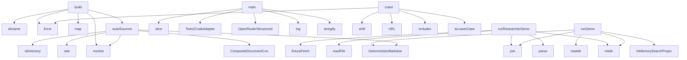

# System Architecture Analysis
<!-- generated in 0.00s -->

## Overview

- **Project**: /home/tom/github/bioxfoundry/twin-dsl
- **Primary Language**: json
- **Languages**: json: 30, typescript: 29, proto: 7, javascript: 3, yaml: 2
- **Analysis Mode**: static
- **Total Functions**: 191
- **Total Classes**: 53
- **Modules**: 79
- **Entry Points**: 122

## Architecture by Module

### src.runtime.biofoundry
- **Functions**: 23
- **Classes**: 6
- **File**: `biofoundry.ts`

### src.research.crawler
- **Functions**: 18
- **Classes**: 3
- **File**: `crawler.ts`

### src.llm.openrouter
- **Functions**: 18
- **Classes**: 3
- **File**: `openrouter.ts`

### src.dsl.math
- **Functions**: 17
- **File**: `math.ts`

### src.llm.dsl-schemas
- **Functions**: 9
- **File**: `dsl-schemas.ts`

### src.adapters.todo2code
- **Functions**: 9
- **Classes**: 1
- **File**: `todo2code.ts`

### src.adapters.clickhouse
- **Functions**: 8
- **Classes**: 4
- **File**: `clickhouse.ts`

### src.scene.openusd
- **Functions**: 7
- **File**: `openusd.ts`

### src.dsl.parser-util
- **Functions**: 7
- **File**: `parser-util.ts`

### src.dsl.tree
- **Functions**: 7
- **File**: `tree.ts`

### src.research.researcher
- **Functions**: 6
- **File**: `researcher.ts`

### src.llm.nl-dsl-compiler
- **Functions**: 6
- **Classes**: 2
- **File**: `nl-dsl-compiler.ts`

### src.ingestion.archive
- **Functions**: 5
- **Classes**: 1
- **File**: `archive.ts`

### src.dsl.query
- **Functions**: 5
- **File**: `query.ts`

### src.core.canonical
- **Functions**: 4
- **File**: `canonical.ts`

### src.cli.main
- **Functions**: 4
- **File**: `main.ts`

### src.runtime.event-store
- **Functions**: 4
- **Classes**: 1
- **File**: `event-store.ts`

### src.runtime.query-runtime
- **Functions**: 4
- **Classes**: 1
- **File**: `query-runtime.ts`

### src.runtime.realtime-watcher
- **Functions**: 4
- **Classes**: 1
- **File**: `realtime-watcher.ts`

### src.ingestion.scanner
- **Functions**: 4
- **Classes**: 2
- **File**: `scanner.ts`

## Key Entry Points

Main execution flows into the system:

### src.runtime.biofoundry.BiofoundryRuntime.build
- **Calls**: src.runtime.biofoundry.resolve, src.runtime.biofoundry.dirname, src.runtime.biofoundry.Error, src.runtime.biofoundry.map, src.runtime.biofoundry.scanSources, src.runtime.biofoundry.parseDql, src.runtime.biofoundry.readFile, src.runtime.biofoundry.String

### src.research.researcher.runResearcherDemo
- **Calls**: src.research.researcher.mkdir, src.research.researcher.parse, src.research.researcher.readFile, src.research.researcher.join, src.research.researcher.fixtureFetch, src.research.researcher.parseDql, src.research.researcher.DqlCrawler, src.research.researcher.crawl

### src.cli.main.main
- **Calls**: src.cli.main.slice, src.cli.main.Todo2CodeAdapter, src.cli.main.OpenRouterStructuredClient, src.cli.main.log, src.cli.main.stringify, src.cli.main.available, src.cli.main.configured, src.cli.main.runDemo

### src.research.crawler.DqlCrawler.crawl
- **Calls**: src.research.crawler.shift, src.research.crawler.URL, src.research.crawler.includes, src.research.crawler.toLowerCase, src.research.crawler.Error, src.research.crawler.networkGuard, src.research.crawler.fetchText, src.research.crawler.toString

### src.runtime.pipeline.runDemo
- **Calls**: src.runtime.pipeline.mkdir, src.runtime.pipeline.DeterministicMarkdownConverter, src.runtime.pipeline.InMemorySearchProjection, src.runtime.pipeline.readdir, src.runtime.pipeline.join, src.runtime.pipeline.convert, src.runtime.pipeline.resourceFromText, src.runtime.pipeline.push

### src.ingestion.scanner.scanSources
- **Calls**: src.ingestion.scanner.CompositeDocumentConverter, src.ingestion.scanner.DeterministicMarkdownConverter, src.ingestion.scanner.resolve, src.ingestion.scanner.stat, src.ingestion.scanner.isDirectory, src.ingestion.scanner.walk, src.ingestion.scanner.relative, src.ingestion.scanner.split

### src.scene.openusd.renderOpenUsd
- **Calls**: src.scene.openusd.Map, src.scene.openusd.flattenTwin, src.scene.openusd.map, src.scene.openusd.get, src.scene.openusd.ident, src.scene.openusd.split, src.scene.openusd.filter, src.scene.openusd.at

### src.scene.openusd.components
- **Calls**: src.scene.openusd.Map, src.scene.openusd.flattenTwin, src.scene.openusd.map, src.scene.openusd.get, src.scene.openusd.ident, src.scene.openusd.split, src.scene.openusd.filter, src.scene.openusd.at

### src.runtime.query-runtime.QueryRuntime.execute
- **Calls**: src.runtime.query-runtime.randomUUID, src.runtime.query-runtime.sha256, src.runtime.query-runtime.find, src.runtime.query-runtime.search, src.runtime.query-runtime.map, src.runtime.query-runtime.canonicalJson, src.runtime.query-runtime.contentUri, src.runtime.query-runtime.startsWith

### src.dsl.query.parseQueryDsl
- **Calls**: src.dsl.query.lines, src.dsl.query.startsWith, src.dsl.query.Error, src.dsl.query.slice, src.dsl.query.trim, src.dsl.query.kv, src.dsl.query.unquote, src.dsl.query.push

### src.adapters.todo2code.Todo2CodeAdapter.extractNl
- **Calls**: src.adapters.todo2code.Todo2CodeAdapter.available, src.adapters.todo2code.Error, src.adapters.todo2code.mkdtemp, src.adapters.todo2code.join, src.adapters.todo2code.tmpdir, src.adapters.todo2code.writeFile, src.adapters.todo2code.run, src.adapters.todo2code.readFile

### src.dsl.dql.parseDql
- **Calls**: src.dsl.dql.lines, src.dsl.dql.match, src.dsl.dql.Error, src.dsl.dql.slice, src.dsl.dql.kv, src.dsl.dql.push, src.dsl.dql.list, src.dsl.dql.positiveInt

### src.adapters.document-converter.DoclingHttpAdapter.convert
- **Calls**: src.adapters.document-converter.readFile, src.adapters.document-converter.FormData, src.adapters.document-converter.set, src.adapters.document-converter.Blob, src.adapters.document-converter.basename, src.adapters.document-converter.fetch, src.adapters.document-converter.replace, src.adapters.document-converter.timeout

### src.dsl.math.evaluateMath
- **Calls**: src.dsl.math.Map, src.dsl.math.map, src.dsl.math.get, src.dsl.math.ev, src.dsl.math.Error, src.dsl.math.every, src.dsl.math.truth, src.dsl.math.some

### scripts.demo-realtime-biofoundry.tmp
- **Calls**: scripts.demo-realtime-biofoundry.mkdtemp, scripts.demo-realtime-biofoundry.join, scripts.demo-realtime-biofoundry.tmpdir, scripts.demo-realtime-biofoundry.rm, scripts.demo-realtime-biofoundry.cp, scripts.demo-realtime-biofoundry.BiofoundryRuntime, scripts.demo-realtime-biofoundry.build, scripts.demo-realtime-biofoundry.parse

### src.llm.openrouter.OpenRouterStructuredClient.controller
- **Calls**: src.llm.openrouter.fetchImpl, src.llm.openrouter.stringify, src.llm.openrouter.OpenRouterStructuredClient.text, src.llm.openrouter.Error, src.llm.openrouter.slice, src.llm.openrouter.parse, src.llm.openrouter.isArray, src.llm.openrouter.contentText

### src.adapters.todo2code.Todo2CodeAdapter.dir
- **Calls**: src.adapters.todo2code.mkdtemp, src.adapters.todo2code.join, src.adapters.todo2code.tmpdir, src.adapters.todo2code.writeFile, src.adapters.todo2code.run, src.adapters.todo2code.readFile, src.adapters.todo2code.split, src.adapters.todo2code.filter

### src.dsl.math.renderMathDsl
- **Calls**: src.dsl.math.String, src.dsl.math.val, src.dsl.math.AND, src.dsl.math.map, src.dsl.math.join, src.dsl.math.OR, src.dsl.math.NOT, src.dsl.math.ex

### src.dsl.tree.parseTreeDsl
- **Calls**: src.dsl.tree.lines, src.dsl.tree.match, src.dsl.tree.Error, src.dsl.tree.split, src.dsl.tree.slice, src.dsl.tree.trim, src.dsl.tree.startsWith, src.dsl.tree.unquote

### src.dsl.math.env
- **Calls**: src.dsl.math.get, src.dsl.math.ev, src.dsl.math.Error, src.dsl.math.every, src.dsl.math.truth, src.dsl.math.some, src.dsl.math.stringify, src.dsl.math.numeric

### src.research.researcher.snapshot
- **Calls**: src.research.researcher.repeat, src.research.researcher.parseQueryDsl, src.research.researcher.readFile, src.research.researcher.join, src.research.researcher.replace, src.research.researcher.parseTreeDsl, src.research.researcher.QueryRuntime, src.research.researcher.InMemoryEventStore

### src.research.researcher.source
- **Calls**: src.research.researcher.repeat, src.research.researcher.parseQueryDsl, src.research.researcher.readFile, src.research.researcher.join, src.research.researcher.replace, src.research.researcher.parseTreeDsl, src.research.researcher.QueryRuntime, src.research.researcher.InMemoryEventStore

### src.llm.nl-dsl-compiler.NlDslCompiler.compile
- **Calls**: src.llm.nl-dsl-compiler.now, src.llm.nl-dsl-compiler.NlDslCompiler.deterministic, src.llm.nl-dsl-compiler.extractNl, src.llm.nl-dsl-compiler.sha256, src.llm.nl-dsl-compiler.canonicalJson, src.llm.nl-dsl-compiler.String, src.llm.nl-dsl-compiler.generationContract, src.llm.nl-dsl-compiler.join

### src.adapters.document-converter.DeterministicMarkdownConverter.convert
- **Calls**: src.adapters.document-converter.extname, src.adapters.document-converter.toLowerCase, src.adapters.document-converter.includes, src.adapters.document-converter.Error, src.adapters.document-converter.readFile, src.adapters.document-converter.stat, src.adapters.document-converter.basename, src.adapters.document-converter.slice

### src.runtime.realtime-watcher.RealtimeTwinWatcher.start
- **Calls**: src.runtime.realtime-watcher.Number, src.runtime.realtime-watcher.Error, src.runtime.realtime-watcher.RealtimeTwinWatcher.runOnce, src.runtime.realtime-watcher.onUpdate, src.runtime.realtime-watcher.error, src.runtime.realtime-watcher.String, src.runtime.realtime-watcher.RealtimeTwinWatcher.tick, src.runtime.realtime-watcher.setInterval

### src.llm.openrouter.OpenRouterStructuredClient.generate
- **Calls**: src.llm.openrouter.OpenRouterStructuredClient.configured, src.llm.openrouter.Error, src.llm.openrouter.now, src.llm.openrouter.OpenRouterStructuredClient.request, src.llm.openrouter.String, src.llm.openrouter.test, src.llm.openrouter.sleep, src.llm.openrouter.min

### src.llm.dsl-schemas.validateResourcePlan
- **Calls**: src.llm.dsl-schemas.obj, src.llm.dsl-schemas.exact, src.llm.dsl-schemas.Error, src.llm.dsl-schemas.isArray, src.llm.dsl-schemas.map, src.llm.dsl-schemas.includes, src.llm.dsl-schemas.String, src.llm.dsl-schemas.strings

### src.llm.dsl-schemas.validateSceneEnvelope
- **Calls**: src.llm.dsl-schemas.obj, src.llm.dsl-schemas.exact, src.llm.dsl-schemas.keys, src.llm.dsl-schemas.includes, src.llm.dsl-schemas.Error, src.llm.dsl-schemas.String, src.llm.dsl-schemas.isArray, src.llm.dsl-schemas.validateScene

### src.scene.openusd.sceneDiff
- **Calls**: src.scene.openusd.Map, src.scene.openusd.map, src.scene.openusd.key, src.scene.openusd.stringify, src.scene.openusd.keys, src.scene.openusd.filter, src.scene.openusd.has, src.scene.openusd.get

### src.ingestion.archive.readZip
- **Calls**: src.ingestion.archive.limit, src.ingestion.archive.execFileAsync, src.ingestion.archive.split, src.ingestion.archive.filter, src.ingestion.archive.Error, src.ingestion.archive.endsWith, src.ingestion.archive.safePath, src.ingestion.archive.push

## Process Flows

Key execution flows identified:

### Flow 1: build
```
build [src.runtime.biofoundry.BiofoundryRuntime]
```

### Flow 2: runResearcherDemo
```
runResearcherDemo [src.research.researcher]
```

### Flow 3: main
```
main [src.cli.main]
```

### Flow 4: crawl
```
crawl [src.research.crawler.DqlCrawler]
```

### Flow 5: runDemo
```
runDemo [src.runtime.pipeline]
```

### Flow 6: scanSources
```
scanSources [src.ingestion.scanner]
```

### Flow 7: renderOpenUsd
```
renderOpenUsd [src.scene.openusd]
```

### Flow 8: components
```
components [src.scene.openusd]
```

### Flow 9: execute
```
execute [src.runtime.query-runtime.QueryRuntime]
```

### Flow 10: parseQueryDsl
```
parseQueryDsl [src.dsl.query]
```

## Key Classes

### src.runtime.biofoundry.BiofoundryRuntime
- **Methods**: 13
- **Key Methods**: src.runtime.biofoundry.BiofoundryRuntime.build, src.runtime.biofoundry.BiofoundryRuntime.absoluteConfig, src.runtime.biofoundry.BiofoundryRuntime.resources, src.runtime.biofoundry.BiofoundryRuntime.previousResources, src.runtime.biofoundry.BiofoundryRuntime.changes, src.runtime.biofoundry.BiofoundryRuntime.policyPath, src.runtime.biofoundry.BiofoundryRuntime.policy, src.runtime.biofoundry.BiofoundryRuntime.policyResource, src.runtime.biofoundry.BiofoundryRuntime.mathGen, src.runtime.biofoundry.BiofoundryRuntime.twinGen

### src.llm.openrouter.OpenRouterStructuredClient
- **Methods**: 13
- **Key Methods**: src.llm.openrouter.OpenRouterStructuredClient.configured, src.llm.openrouter.OpenRouterStructuredClient.generate, src.llm.openrouter.OpenRouterStructuredClient.started, src.llm.openrouter.OpenRouterStructuredClient.request, src.llm.openrouter.OpenRouterStructuredClient.controller, src.llm.openrouter.OpenRouterStructuredClient.responseFormat, src.llm.openrouter.OpenRouterStructuredClient.response, src.llm.openrouter.OpenRouterStructuredClient.text, src.llm.openrouter.OpenRouterStructuredClient.envelope, src.llm.openrouter.OpenRouterStructuredClient.message

### src.adapters.todo2code.Todo2CodeAdapter
- **Methods**: 8
- **Key Methods**: src.adapters.todo2code.Todo2CodeAdapter.available, src.adapters.todo2code.Todo2CodeAdapter.loadFixture, src.adapters.todo2code.Todo2CodeAdapter.extract, src.adapters.todo2code.Todo2CodeAdapter.extractNl, src.adapters.todo2code.Todo2CodeAdapter.dir, src.adapters.todo2code.Todo2CodeAdapter.input, src.adapters.todo2code.Todo2CodeAdapter.mapped, src.adapters.todo2code.Todo2CodeAdapter.raw

### src.llm.nl-dsl-compiler.NlDslCompiler
- **Methods**: 6
- **Key Methods**: src.llm.nl-dsl-compiler.NlDslCompiler.compile, src.llm.nl-dsl-compiler.NlDslCompiler.started, src.llm.nl-dsl-compiler.NlDslCompiler.contract, src.llm.nl-dsl-compiler.NlDslCompiler.response, src.llm.nl-dsl-compiler.NlDslCompiler.deterministic, src.llm.nl-dsl-compiler.NlDslCompiler.value

### src.runtime.event-store.InMemoryEventStore
- **Methods**: 4
- **Key Methods**: src.runtime.event-store.InMemoryEventStore.append, src.runtime.event-store.InMemoryEventStore.xs, src.runtime.event-store.InMemoryEventStore.read, src.runtime.event-store.InMemoryEventStore.all

### src.runtime.query-runtime.QueryRuntime
- **Methods**: 4
- **Key Methods**: src.runtime.query-runtime.QueryRuntime.execute, src.runtime.query-runtime.QueryRuntime.executionId, src.runtime.query-runtime.QueryRuntime.term, src.runtime.query-runtime.QueryRuntime.evidence

### src.runtime.realtime-watcher.RealtimeTwinWatcher
- **Methods**: 4
- **Key Methods**: src.runtime.realtime-watcher.RealtimeTwinWatcher.runOnce, src.runtime.realtime-watcher.RealtimeTwinWatcher.start, src.runtime.realtime-watcher.RealtimeTwinWatcher.tick, src.runtime.realtime-watcher.RealtimeTwinWatcher.stop

### src.adapters.clickhouse.InMemorySearchProjection
- **Methods**: 4
- **Key Methods**: src.adapters.clickhouse.InMemorySearchProjection.upsert, src.adapters.clickhouse.InMemorySearchProjection.search, src.adapters.clickhouse.InMemorySearchProjection.all, src.adapters.clickhouse.InMemorySearchProjection.sqlString

### src.adapters.clickhouse.ClickHouseHttpProjection
- **Methods**: 4
- **Key Methods**: src.adapters.clickhouse.ClickHouseHttpProjection.query, src.adapters.clickhouse.ClickHouseHttpProjection.upsert, src.adapters.clickhouse.ClickHouseHttpProjection.search, src.adapters.clickhouse.ClickHouseHttpProjection.all

### src.research.crawler.DqlCrawler
- **Methods**: 2
- **Key Methods**: src.research.crawler.DqlCrawler.crawl, src.research.crawler.DqlCrawler.robots

### src.adapters.document-converter.DeterministicMarkdownConverter
- **Methods**: 1
- **Key Methods**: src.adapters.document-converter.DeterministicMarkdownConverter.convert

### src.adapters.document-converter.DoclingHttpAdapter
- **Methods**: 1
- **Key Methods**: src.adapters.document-converter.DoclingHttpAdapter.convert

### src.adapters.document-converter.CompositeDocumentConverter
- **Methods**: 1
- **Key Methods**: src.adapters.document-converter.CompositeDocumentConverter.convert

### src.core.types.SourceAnchor
- **Methods**: 0

### src.core.types.ResourceRecord
- **Methods**: 0

### src.core.types.ResourcePlan
- **Methods**: 0

### src.core.types.IntentRecord
- **Methods**: 0

### src.core.types.QueryFilter
- **Methods**: 0

### src.core.types.QueryContract
- **Methods**: 0

### src.core.types.DqlCrawlPlan
- **Methods**: 0

## Data Transformation Functions

Key functions that process and transform data:

### src.core.uri.assertProcessUri
- **Output to**: src.core.uri.test, src.core.uri.Error

### src.research.crawler.decode
- **Output to**: src.research.crawler.replace

### src.llm.openrouter.OpenRouterStructuredClient.responseFormat

### src.llm.dsl-schemas.validateResourcePlan
- **Output to**: src.llm.dsl-schemas.obj, src.llm.dsl-schemas.exact, src.llm.dsl-schemas.Error, src.llm.dsl-schemas.isArray, src.llm.dsl-schemas.map

### src.llm.dsl-schemas.validateTwinEnvelope
- **Output to**: src.llm.dsl-schemas.obj, src.llm.dsl-schemas.exact, src.llm.dsl-schemas.isArray, src.llm.dsl-schemas.map, src.llm.dsl-schemas.validateTwin

### src.llm.dsl-schemas.validateSceneEnvelope
- **Output to**: src.llm.dsl-schemas.obj, src.llm.dsl-schemas.exact, src.llm.dsl-schemas.keys, src.llm.dsl-schemas.includes, src.llm.dsl-schemas.Error

### src.adapters.document-converter.DeterministicMarkdownConverter.convert
- **Output to**: src.adapters.document-converter.extname, src.adapters.document-converter.toLowerCase, src.adapters.document-converter.includes, src.adapters.document-converter.Error, src.adapters.document-converter.readFile

### src.adapters.document-converter.DoclingHttpAdapter.convert
- **Output to**: src.adapters.document-converter.readFile, src.adapters.document-converter.FormData, src.adapters.document-converter.set, src.adapters.document-converter.Blob, src.adapters.document-converter.basename

### src.adapters.document-converter.CompositeDocumentConverter.convert
- **Output to**: src.adapters.document-converter.startsWith

### src.dsl.intent.validateT2cIntent
- **Output to**: src.dsl.intent.isArray, src.dsl.intent.Error, src.dsl.intent.map

### src.dsl.query.parseQueryDsl
- **Output to**: src.dsl.query.lines, src.dsl.query.startsWith, src.dsl.query.Error, src.dsl.query.slice, src.dsl.query.trim

### src.dsl.math.parseMathDsl
- **Output to**: src.dsl.math.lines, src.dsl.math.match, src.dsl.math.Error, src.dsl.math.slice, src.dsl.math.push

### src.dsl.twin.validateTwin
- **Output to**: src.dsl.twin.Error, src.dsl.twin.test, src.dsl.twin.isArray, src.dsl.twin.visit

### src.dsl.tree.parseTreeDsl
- **Output to**: src.dsl.tree.lines, src.dsl.tree.match, src.dsl.tree.Error, src.dsl.tree.split, src.dsl.tree.slice

### src.dsl.scene.validateScene
- **Output to**: src.dsl.scene.includes, src.dsl.scene.Error, src.dsl.scene.startsWith, src.dsl.scene.has, src.dsl.scene.add

### src.dsl.dql.parseDql
- **Output to**: src.dsl.dql.lines, src.dsl.dql.match, src.dsl.dql.Error, src.dsl.dql.slice, src.dsl.dql.kv

### deploy.docling.server.convert
- **Output to**: app.post, pathlib.Path, tempfile.NamedTemporaryFile, f.write, f.flush

## Public API Surface

Functions exposed as public API (no underscore prefix):

- `src.runtime.biofoundry.BiofoundryRuntime.build` - 38 calls
- `src.research.researcher.runResearcherDemo` - 29 calls
- `src.cli.main.main` - 27 calls
- `src.research.crawler.DqlCrawler.crawl` - 26 calls
- `src.runtime.pipeline.runDemo` - 24 calls
- `src.ingestion.scanner.scanSources` - 21 calls
- `src.scene.openusd.renderOpenUsd` - 16 calls
- `src.scene.openusd.components` - 16 calls
- `src.research.crawler.htmlToMarkdown` - 14 calls
- `src.runtime.query-runtime.QueryRuntime.execute` - 14 calls
- `src.llm.openrouter.OpenRouterStructuredClient.request` - 14 calls
- `src.dsl.query.parseQueryDsl` - 14 calls
- `src.adapters.todo2code.Todo2CodeAdapter.extractNl` - 13 calls
- `src.dsl.dql.parseDql` - 13 calls
- `src.adapters.document-converter.DoclingHttpAdapter.convert` - 12 calls
- `src.dsl.math.evaluateMath` - 12 calls
- `scripts.demo-realtime-biofoundry.tmp` - 12 calls
- `src.llm.openrouter.OpenRouterStructuredClient.controller` - 11 calls
- `src.adapters.todo2code.Todo2CodeAdapter.dir` - 11 calls
- `src.dsl.math.expr` - 11 calls
- `src.dsl.math.renderMathDsl` - 11 calls
- `src.dsl.tree.parseTreeDsl` - 11 calls
- `src.dsl.math.env` - 10 calls
- `src.research.researcher.snapshot` - 9 calls
- `src.research.researcher.source` - 9 calls
- `src.llm.nl-dsl-compiler.NlDslCompiler.compile` - 9 calls
- `src.adapters.document-converter.DeterministicMarkdownConverter.convert` - 9 calls
- `src.dsl.math.ev` - 9 calls
- `src.runtime.realtime-watcher.RealtimeTwinWatcher.start` - 8 calls
- `src.llm.openrouter.OpenRouterStructuredClient.generate` - 8 calls
- `src.llm.dsl-schemas.validateResourcePlan` - 8 calls
- `src.llm.dsl-schemas.validateSceneEnvelope` - 8 calls
- `src.scene.openusd.sceneDiff` - 8 calls
- `src.ingestion.archive.readZip` - 8 calls
- `src.dsl.query.xs` - 8 calls
- `src.dsl.query.id` - 8 calls
- `src.dsl.math.parseMathDsl` - 8 calls
- `src.dsl.math.ex` - 8 calls
- `deploy.docling.server.convert` - 8 calls
- `scripts.check-proto-contracts.files` - 8 calls

## System Interactions

How components interact:



## Reverse Engineering Guidelines

1. **Entry Points**: Start analysis from the entry points listed above
2. **Core Logic**: Focus on classes with many methods
3. **Data Flow**: Follow data transformation functions
4. **Process Flows**: Use the flow diagrams for execution paths
5. **API Surface**: Public API functions reveal the interface

## Context for LLM

Maintain the identified architectural patterns and public API surface when suggesting changes.