# System Architecture Analysis
<!-- generated in 0.00s -->

## Overview

- **Project**: /home/tom/github/bioxfoundry/twin-dsl
- **Primary Language**: typescript
- **Languages**: typescript: 54, json: 51, proto: 12, python: 9, javascript: 9
- **Analysis Mode**: static
- **Total Functions**: 885
- **Total Classes**: 118
- **Modules**: 151
- **Entry Points**: 675

## Architecture by Module

### src.runtime.living-project
- **Functions**: 104
- **Classes**: 1
- **File**: `living-project.ts`

### src.runtime.autonomy
- **Functions**: 53
- **Classes**: 2
- **File**: `autonomy.ts`

### src.runtime.mutation-grant
- **Functions**: 43
- **Classes**: 1
- **File**: `mutation-grant.ts`

### src.project.wizard
- **Functions**: 43
- **Classes**: 1
- **File**: `wizard.ts`

### js.f2md.src.converters
- **Functions**: 34
- **Classes**: 5
- **File**: `converters.ts`

### src.scene.openusd
- **Functions**: 30
- **Classes**: 1
- **File**: `openusd.ts`

### src.scene.physical-evidence
- **Functions**: 29
- **File**: `physical-evidence.ts`

### src.runtime.mutation-pipeline
- **Functions**: 28
- **Classes**: 2
- **File**: `mutation-pipeline.ts`

### src.ingestion.scanner
- **Functions**: 28
- **Classes**: 2
- **File**: `scanner.ts`

### src.serve.dashboard
- **Functions**: 27
- **Classes**: 2
- **File**: `dashboard.ts`

### src.scene.blueprint
- **Functions**: 27
- **File**: `blueprint.ts`

### src.runtime.biofoundry-concept
- **Functions**: 24
- **Classes**: 1
- **File**: `biofoundry-concept.ts`

### src.runtime.biofoundry
- **Functions**: 23
- **Classes**: 6
- **File**: `biofoundry.ts`

### src.adapters.todo2code
- **Functions**: 23
- **Classes**: 3
- **File**: `todo2code.ts`

### src.cli.main
- **Functions**: 21
- **File**: `main.ts`

### src.adapters.twin-probes
- **Functions**: 19
- **Classes**: 5
- **File**: `twin-probes.ts`

### src.research.crawler
- **Functions**: 18
- **Classes**: 3
- **File**: `crawler.ts`

### src.llm.openrouter
- **Functions**: 18
- **Classes**: 3
- **File**: `openrouter.ts`

### js.f2md.src.tree
- **Functions**: 18
- **Classes**: 2
- **File**: `tree.ts`

### py.f2md.src.f2md.converters
- **Functions**: 18
- **Classes**: 8
- **File**: `converters.py`

## Key Entry Points

Main execution flows into the system:

### src.cli.main.main
- **Calls**: src.cli.main.slice, src.cli.main.Todo2CodeAdapter, src.cli.main.TwinProbesAdapter, src.cli.main.OpenRouterStructuredClient, src.cli.main.log, src.cli.main.stringify, src.cli.main.available, src.cli.main.configured

### src.runtime.biofoundry.BiofoundryRuntime.build
- **Calls**: src.runtime.biofoundry.resolve, src.runtime.biofoundry.dirname, src.runtime.biofoundry.Error, src.runtime.biofoundry.map, src.runtime.biofoundry.scanSources, src.runtime.biofoundry.parseDql, src.runtime.biofoundry.readFile, src.runtime.biofoundry.String

### py.f2md.src.f2md.cli.main
- **Calls**: argparse.ArgumentParser, parser.add_argument, parser.add_argument, parser.add_argument, parser.add_argument, parser.add_argument, parser.add_argument, parser.add_argument

### py.f2md.src.f2md.converters.DoclingHttpConverter.convert
- **Calls**: py.f2md.src.f2md.detect.detect_document_kind, os.path.basename, None.encode, urllib.request.Request, data.get, ConvertedDocument, open, handle.read

### src.serve.dashboard.startDashboard
- **Calls**: src.serve.dashboard.assetRoot, src.serve.dashboard.join, src.serve.dashboard.resolve, src.serve.dashboard.LivingProjectRuntime, src.serve.dashboard.all, src.serve.dashboard.readJson, src.serve.dashboard.Date, src.serve.dashboard.toISOString

### src.research.researcher.runResearcherDemo
- **Calls**: src.research.researcher.mkdir, src.research.researcher.parse, src.research.researcher.readFile, src.research.researcher.join, src.research.researcher.fixtureFetch, src.research.researcher.parseDql, src.research.researcher.DqlCrawler, src.research.researcher.crawl

### src.research.crawler.DqlCrawler.crawl
- **Calls**: src.research.crawler.shift, src.research.crawler.URL, src.research.crawler.includes, src.research.crawler.toLowerCase, src.research.crawler.Error, src.research.crawler.networkGuard, src.research.crawler.fetchText, src.research.crawler.toString

### src.ingestion.scanner.scanSources
- **Calls**: src.ingestion.scanner.composite, src.ingestion.scanner.CompositeDocumentConverter, src.ingestion.scanner.resolve, src.ingestion.scanner.stat, src.ingestion.scanner.isDirectory, src.ingestion.scanner.walk, src.ingestion.scanner.relative, src.ingestion.scanner.split

### py.f2md.src.f2md.converters.PyMuPDFConverter.convert
- **Calls**: py.f2md.src.f2md.detect.detect_document_kind, chatter.text.strip, py.f2md.src.f2md.converters._clip, src.dsl.improvement.bool, py.f2md.src.f2md.converters._stat_metadata, len, ConvertedDocument, ExternalConverterRequired

### src.runtime.pipeline.runDemo
- **Calls**: src.runtime.pipeline.mkdir, src.runtime.pipeline.DeterministicMarkdownConverter, src.runtime.pipeline.InMemorySearchProjection, src.runtime.pipeline.readdir, src.runtime.pipeline.join, src.runtime.pipeline.convert, src.runtime.pipeline.resourceFromText, src.runtime.pipeline.push

### src.ingestion.scanner.texts
- **Calls**: src.ingestion.scanner.resolve, src.ingestion.scanner.stat, src.ingestion.scanner.isDirectory, src.ingestion.scanner.walk, src.ingestion.scanner.relative, src.ingestion.scanner.split, src.ingestion.scanner.at, src.ingestion.scanner.extname

### src.ingestion.scanner.converter
- **Calls**: src.ingestion.scanner.resolve, src.ingestion.scanner.stat, src.ingestion.scanner.isDirectory, src.ingestion.scanner.walk, src.ingestion.scanner.relative, src.ingestion.scanner.split, src.ingestion.scanner.at, src.ingestion.scanner.extname

### src.project.wizard.addProjectSource
- **Calls**: src.project.wizard.resolve, src.project.wizard.dirname, src.project.wizard.parseProjectDsl, src.project.wizard.readFile, src.project.wizard.exists, src.project.wizard.Error, src.project.wizard.relative, src.project.wizard.startsWith

### src.runtime.mutation-pipeline.proposeCodeMutation
- **Calls**: src.runtime.mutation-pipeline.Date, src.runtime.mutation-pipeline.toISOString, src.runtime.mutation-pipeline.randomUUID, src.runtime.mutation-pipeline.resolve, src.runtime.mutation-pipeline.mkdir, src.runtime.mutation-pipeline.join, src.runtime.mutation-pipeline.Error, src.runtime.mutation-pipeline.loadPlan

### src.runtime.mutation-pipeline.applyCodeMutation
- **Calls**: src.runtime.mutation-pipeline.Error, src.runtime.mutation-pipeline.trim, src.runtime.mutation-pipeline.loadPlan, src.runtime.mutation-pipeline.planHashOf, src.runtime.mutation-pipeline.resolveGrant, src.runtime.mutation-pipeline.join, src.runtime.mutation-pipeline.resolve, src.runtime.mutation-pipeline.consumeMutationGrantJti

### src.serve.dashboard.server
- **Calls**: src.serve.dashboard.createServer, src.serve.dashboard.URL, src.serve.dashboard.send, src.serve.dashboard.readFile, src.serve.dashboard.join, src.serve.dashboard.sendJson, src.serve.dashboard.state, src.serve.dashboard.renderOpenUsd

### js.f2md.src.tree.convertTree
- **Calls**: js.f2md.src.tree.resolve, js.f2md.src.tree.stat, js.f2md.src.tree.isDirectory, js.f2md.src.tree.ConversionError, js.f2md.src.tree.startsWith, js.f2md.src.tree.defaultChain, js.f2md.src.tree.walkFiles, js.f2md.src.tree.relative

### src.ingestion.scanner.absolute
- **Calls**: src.ingestion.scanner.isDirectory, src.ingestion.scanner.relative, src.ingestion.scanner.split, src.ingestion.scanner.at, src.ingestion.scanner.extname, src.ingestion.scanner.toLowerCase, src.ingestion.scanner.map, src.ingestion.scanner.join

### src.ingestion.scanner.s
- **Calls**: src.ingestion.scanner.isDirectory, src.ingestion.scanner.relative, src.ingestion.scanner.split, src.ingestion.scanner.at, src.ingestion.scanner.extname, src.ingestion.scanner.toLowerCase, src.ingestion.scanner.map, src.ingestion.scanner.join

### src.ingestion.scanner.files
- **Calls**: src.ingestion.scanner.isDirectory, src.ingestion.scanner.relative, src.ingestion.scanner.split, src.ingestion.scanner.at, src.ingestion.scanner.extname, src.ingestion.scanner.toLowerCase, src.ingestion.scanner.map, src.ingestion.scanner.join

### src.dsl.project.parseProjectDsl
- **Calls**: src.dsl.project.lines, src.dsl.project.shift, src.dsl.project.match, src.dsl.project.Error, src.dsl.project.indexOf, src.dsl.project.slice, src.dsl.project.toUpperCase, src.dsl.project.trim

### src.scene.physical-evidence.applyPhysicalEvidence
- **Calls**: src.scene.physical-evidence.Set, src.scene.physical-evidence.Map, src.scene.physical-evidence.map, src.scene.physical-evidence.filter, src.scene.physical-evidence.Boolean, src.scene.physical-evidence.get, src.scene.physical-evidence.push, src.scene.physical-evidence.has

### src.project.wizard.createLivingProject
- **Calls**: src.project.wizard.slug, src.project.wizard.resolve, src.project.wizard.basePort, src.project.wizard.exists, src.project.wizard.readdir, src.project.wizard.Error, src.project.wizard.mkdir, src.project.wizard.join

### js.f2md.src.tree.paths
- **Calls**: js.f2md.src.tree.relative, js.f2md.src.tree.detectDocumentKind, js.f2md.src.tree.includes, js.f2md.src.tree.join, js.f2md.src.tree.mkdir, js.f2md.src.tree.dirname, js.f2md.src.tree.resolve, js.f2md.src.tree.mediaTypeFor

### js.f2md.src.converters.DoclingHttpConverter.convert
- **Calls**: js.f2md.src.converters.detectDocumentKind, js.f2md.src.converters.readFile, js.f2md.src.converters.FormData, js.f2md.src.converters.set, js.f2md.src.converters.Blob, js.f2md.src.converters.Uint8Array, js.f2md.src.converters.basename, js.f2md.src.converters.fetch

### src.scene.blueprint.materializeBlueprintTwin
- **Calls**: src.scene.blueprint.filter, src.scene.blueprint.map, src.scene.blueprint.set, src.scene.blueprint.matchResources, src.scene.blueprint.push, src.scene.blueprint.unique, src.scene.blueprint.slice, src.scene.blueprint.test

### py.f2md.src.f2md.converters.MarkItDownConverter.convert
- **Calls**: py.f2md.src.f2md.detect.detect_document_kind, py.f2md.src.f2md.converters._clip, py.f2md.src.f2md.converters._stat_metadata, len, getattr, ConvertedDocument, ExternalConverterRequired, MarkItDown

### py.f2md.src.f2md.chain.ConverterChain.convert
- **Calls**: time.monotonic, enumerate, ExternalConverterRequired, os.path.isfile, ConversionError, os.path.splitext, int, document.with_routing

### src.dsl.observation.parseObservationDsl
- **Calls**: src.dsl.observation.lines, src.dsl.observation.shift, src.dsl.observation.startsWith, src.dsl.observation.Error, src.dsl.observation.match, src.dsl.observation.slice, src.dsl.observation.trim, src.dsl.observation.push

### js.f2md.src.cli.main
- **Calls**: js.f2md.src.cli.split, js.f2md.src.cli.map, js.f2md.src.cli.trim, js.f2md.src.cli.filter, js.f2md.src.cli.log, js.f2md.src.cli.startsWith, js.f2md.src.cli.error, js.f2md.src.cli.push

## Process Flows

Key execution flows identified:

### Flow 1: main
```
main [src.cli.main]
```

### Flow 2: build
```
build [src.runtime.biofoundry.BiofoundryRuntime]
```

### Flow 3: convert
```
convert [py.f2md.src.f2md.converters.DoclingHttpConverter]
  └─ →> detect_document_kind
```

### Flow 4: startDashboard
```
startDashboard [src.serve.dashboard]
  └─> assetRoot
```

### Flow 5: runResearcherDemo
```
runResearcherDemo [src.research.researcher]
```

### Flow 6: crawl
```
crawl [src.research.crawler.DqlCrawler]
```

### Flow 7: scanSources
```
scanSources [src.ingestion.scanner]
```

### Flow 8: runDemo
```
runDemo [src.runtime.pipeline]
```

### Flow 9: texts
```
texts [src.ingestion.scanner]
```

### Flow 10: converter
```
converter [src.ingestion.scanner]
```

## Key Classes

### src.runtime.living-project.LivingProjectRuntime
- **Methods**: 68
- **Key Methods**: src.runtime.living-project.LivingProjectRuntime.load, src.runtime.living-project.LivingProjectRuntime.text, src.runtime.living-project.LivingProjectRuntime.iterate, src.runtime.living-project.LivingProjectRuntime.absolute, src.runtime.living-project.LivingProjectRuntime.project, src.runtime.living-project.LivingProjectRuntime.lease, src.runtime.living-project.LivingProjectRuntime.iterateWithLease, src.runtime.living-project.LivingProjectRuntime.startedAt, src.runtime.living-project.LivingProjectRuntime.traceId, src.runtime.living-project.LivingProjectRuntime.base

### src.adapters.todo2code.Todo2CodeAdapter
- **Methods**: 20
- **Key Methods**: src.adapters.todo2code.Todo2CodeAdapter.available, src.adapters.todo2code.Todo2CodeAdapter.loadFixture, src.adapters.todo2code.Todo2CodeAdapter.extract, src.adapters.todo2code.Todo2CodeAdapter.readLatestAnalysis, src.adapters.todo2code.Todo2CodeAdapter.latest, src.adapters.todo2code.Todo2CodeAdapter.runBase, src.adapters.todo2code.Todo2CodeAdapter.manifest, src.adapters.todo2code.Todo2CodeAdapter.manifestObject, src.adapters.todo2code.Todo2CodeAdapter.graph, src.adapters.todo2code.Todo2CodeAdapter.diagnostics

### src.runtime.biofoundry.BiofoundryRuntime
- **Methods**: 13
- **Key Methods**: src.runtime.biofoundry.BiofoundryRuntime.build, src.runtime.biofoundry.BiofoundryRuntime.absoluteConfig, src.runtime.biofoundry.BiofoundryRuntime.resources, src.runtime.biofoundry.BiofoundryRuntime.previousResources, src.runtime.biofoundry.BiofoundryRuntime.changes, src.runtime.biofoundry.BiofoundryRuntime.policyPath, src.runtime.biofoundry.BiofoundryRuntime.policy, src.runtime.biofoundry.BiofoundryRuntime.policyResource, src.runtime.biofoundry.BiofoundryRuntime.mathGen, src.runtime.biofoundry.BiofoundryRuntime.twinGen

### src.llm.openrouter.OpenRouterStructuredClient
- **Methods**: 13
- **Key Methods**: src.llm.openrouter.OpenRouterStructuredClient.configured, src.llm.openrouter.OpenRouterStructuredClient.generate, src.llm.openrouter.OpenRouterStructuredClient.started, src.llm.openrouter.OpenRouterStructuredClient.request, src.llm.openrouter.OpenRouterStructuredClient.controller, src.llm.openrouter.OpenRouterStructuredClient.responseFormat, src.llm.openrouter.OpenRouterStructuredClient.response, src.llm.openrouter.OpenRouterStructuredClient.text, src.llm.openrouter.OpenRouterStructuredClient.envelope, src.llm.openrouter.OpenRouterStructuredClient.message

### src.runtime.living-watcher.LivingProjectWatcher
- **Methods**: 12
- **Key Methods**: src.runtime.living-watcher.LivingProjectWatcher.runOnce, src.runtime.living-watcher.LivingProjectWatcher.maxRetryMs, src.runtime.living-watcher.LivingProjectWatcher.schedule, src.runtime.living-watcher.LivingProjectWatcher.tick, src.runtime.living-watcher.LivingProjectWatcher.result, src.runtime.living-watcher.LivingProjectWatcher.schedule, src.runtime.living-watcher.LivingProjectWatcher.project, src.runtime.living-watcher.LivingProjectWatcher.failureExponent, src.runtime.living-watcher.LivingProjectWatcher.retryAfterMs, src.runtime.living-watcher.LivingProjectWatcher.failure

### js.f2md.src.converters.MammothConverter
- **Methods**: 9
- **Key Methods**: js.f2md.src.converters.MammothConverter.convert, js.f2md.src.converters.MammothConverter.kind, js.f2md.src.converters.MammothConverter.mammoth, js.f2md.src.converters.MammothConverter.convertToHtml, js.f2md.src.converters.MammothConverter.warnings, js.f2md.src.converters.MammothConverter.htmlToDocument, js.f2md.src.converters.MammothConverter.mod, js.f2md.src.converters.MammothConverter.Turndown, js.f2md.src.converters.MammothConverter.clipped

### js.f2md.src.chain.ConverterChain
- **Methods**: 8
- **Key Methods**: js.f2md.src.chain.ConverterChain.convert, js.f2md.src.chain.ConverterChain.started, js.f2md.src.chain.ConverterChain.lastKind, js.f2md.src.chain.ConverterChain.document, js.f2md.src.chain.ConverterChain.defaultChain, js.f2md.src.chain.ConverterChain.url, js.f2md.src.chain.ConverterChain.convert, js.f2md.src.chain.ConverterChain.convertToMarkdown

### src.llm.nl-dsl-compiler.NlDslCompiler
- **Methods**: 6
- **Key Methods**: src.llm.nl-dsl-compiler.NlDslCompiler.compile, src.llm.nl-dsl-compiler.NlDslCompiler.started, src.llm.nl-dsl-compiler.NlDslCompiler.contract, src.llm.nl-dsl-compiler.NlDslCompiler.response, src.llm.nl-dsl-compiler.NlDslCompiler.deterministic, src.llm.nl-dsl-compiler.NlDslCompiler.value

### src.adapters.twin-probes.TwinProbesAdapter
- **Methods**: 6
- **Key Methods**: src.adapters.twin-probes.TwinProbesAdapter.available, src.adapters.twin-probes.TwinProbesAdapter.loadCycle, src.adapters.twin-probes.TwinProbesAdapter.cycle, src.adapters.twin-probes.TwinProbesAdapter.run, src.adapters.twin-probes.TwinProbesAdapter.out, src.adapters.twin-probes.TwinProbesAdapter.writeSummary

### src.adapters.clickhouse.InMemorySearchProjection
- **Methods**: 6
- **Key Methods**: src.adapters.clickhouse.InMemorySearchProjection.upsert, src.adapters.clickhouse.InMemorySearchProjection.search, src.adapters.clickhouse.InMemorySearchProjection.all, src.adapters.clickhouse.InMemorySearchProjection.sqlString, src.adapters.clickhouse.InMemorySearchProjection.clickHouseDateTime64, src.adapters.clickhouse.InMemorySearchProjection.at

### js.f2md.src.converters.TextConverter
- **Methods**: 5
- **Key Methods**: js.f2md.src.converters.TextConverter.convert, js.f2md.src.converters.TextConverter.kind, js.f2md.src.converters.TextConverter.raw, js.f2md.src.converters.TextConverter.text, js.f2md.src.converters.TextConverter.fence

### js.f2md.src.converters.LocalToolConverter
- **Methods**: 5
- **Key Methods**: js.f2md.src.converters.LocalToolConverter.code, js.f2md.src.converters.LocalToolConverter.detail, js.f2md.src.converters.LocalToolConverter.text, js.f2md.src.converters.LocalToolConverter.convert, js.f2md.src.converters.LocalToolConverter.kind

### js.f2md.src.converters.DoclingHttpConverter
- **Methods**: 5
- **Key Methods**: js.f2md.src.converters.DoclingHttpConverter.convert, js.f2md.src.converters.DoclingHttpConverter.kind, js.f2md.src.converters.DoclingHttpConverter.bytes, js.f2md.src.converters.DoclingHttpConverter.form, js.f2md.src.converters.DoclingHttpConverter.response

### src.runtime.event-store.InMemoryEventStore
- **Methods**: 4
- **Key Methods**: src.runtime.event-store.InMemoryEventStore.append, src.runtime.event-store.InMemoryEventStore.xs, src.runtime.event-store.InMemoryEventStore.read, src.runtime.event-store.InMemoryEventStore.all

### src.runtime.query-runtime.QueryRuntime
- **Methods**: 4
- **Key Methods**: src.runtime.query-runtime.QueryRuntime.execute, src.runtime.query-runtime.QueryRuntime.executionId, src.runtime.query-runtime.QueryRuntime.term, src.runtime.query-runtime.QueryRuntime.evidence

### src.runtime.realtime-watcher.RealtimeTwinWatcher
- **Methods**: 4
- **Key Methods**: src.runtime.realtime-watcher.RealtimeTwinWatcher.runOnce, src.runtime.realtime-watcher.RealtimeTwinWatcher.start, src.runtime.realtime-watcher.RealtimeTwinWatcher.tick, src.runtime.realtime-watcher.RealtimeTwinWatcher.stop

### src.adapters.clickhouse.ClickHouseHttpProjection
- **Methods**: 4
- **Key Methods**: src.adapters.clickhouse.ClickHouseHttpProjection.query, src.adapters.clickhouse.ClickHouseHttpProjection.upsert, src.adapters.clickhouse.ClickHouseHttpProjection.search, src.adapters.clickhouse.ClickHouseHttpProjection.all

### py.f2md.src.f2md.translate.OpenRouterTranslator
> Hosted LLM translation. The text leaves this machine — never use for confidential input.
- **Methods**: 4
- **Key Methods**: py.f2md.src.f2md.translate.OpenRouterTranslator.__init__, py.f2md.src.f2md.translate.OpenRouterTranslator.available, py.f2md.src.f2md.translate.OpenRouterTranslator._call, py.f2md.src.f2md.translate.OpenRouterTranslator.translate

### js.f2md.src.converters.TurndownConverter
- **Methods**: 3
- **Key Methods**: js.f2md.src.converters.TurndownConverter.convert, js.f2md.src.converters.TurndownConverter.kind, js.f2md.src.converters.TurndownConverter.html

### py.f2md.src.f2md.converters.LocalToolConverter
> `pdftotext` (poppler) and `pandoc`, so PDFs and Office files work with no daemon.

Both are looked u
- **Methods**: 3
- **Key Methods**: py.f2md.src.f2md.converters.LocalToolConverter.__init__, py.f2md.src.f2md.converters.LocalToolConverter._run, py.f2md.src.f2md.converters.LocalToolConverter.convert

## Data Transformation Functions

Key functions that process and transform data:

### src.core.uri.assertProcessUri
- **Output to**: src.core.uri.test, src.core.uri.Error

### src.research.crawler.decode
- **Output to**: src.research.crawler.replace

### src.runtime.service-check.parsed
- **Output to**: src.runtime.service-check.parse, src.runtime.service-check.trim

### src.runtime.autonomy.validateTwinGrounding
- **Output to**: src.runtime.autonomy.Error, src.runtime.autonomy.Set, src.runtime.autonomy.map, src.runtime.autonomy.flattenComponents, src.runtime.autonomy.flatMap

### src.runtime.autonomy.validateSceneGrounding
- **Output to**: src.runtime.autonomy.Error, src.runtime.autonomy.Set, src.runtime.autonomy.flattenComponents, src.runtime.autonomy.map, src.runtime.autonomy.contentUri

### src.runtime.mutation-grant.parseB64urlJson
- **Output to**: src.runtime.mutation-grant.parse, src.runtime.mutation-grant.from, src.runtime.mutation-grant.toString

### src.llm.openrouter.OpenRouterStructuredClient.responseFormat

### src.llm.dsl-schemas.validateResourcePlan
- **Output to**: src.llm.dsl-schemas.obj, src.llm.dsl-schemas.exact, src.llm.dsl-schemas.Error, src.llm.dsl-schemas.isArray, src.llm.dsl-schemas.map

### src.llm.dsl-schemas.validateTwinEnvelope
- **Output to**: src.llm.dsl-schemas.obj, src.llm.dsl-schemas.exact, src.llm.dsl-schemas.isArray, src.llm.dsl-schemas.map, src.llm.dsl-schemas.validateTwin

### src.llm.dsl-schemas.validateSceneEnvelope
- **Output to**: src.llm.dsl-schemas.obj, src.llm.dsl-schemas.exact, src.llm.dsl-schemas.keys, src.llm.dsl-schemas.includes, src.llm.dsl-schemas.Error

### src.adapters.twin-probes.validateAutonomCycle
- **Output to**: src.adapters.twin-probes.object, src.adapters.twin-probes.Error, src.adapters.twin-probes.trim, src.adapters.twin-probes.isArray, src.adapters.twin-probes.every

### src.adapters.todo2code.processHandle
- **Output to**: src.adapters.todo2code.spawn

### src.dsl.intent.validateT2cIntent
- **Output to**: src.dsl.intent.isArray, src.dsl.intent.Error, src.dsl.intent.map

### src.dsl.improvement.parseImprovementDsl
- **Output to**: src.dsl.improvement.lines, src.dsl.improvement.shift, src.dsl.improvement.match, src.dsl.improvement.Error, src.dsl.improvement.split

### src.dsl.improvement.validateImprovement
- **Output to**: src.dsl.improvement.isArray, src.dsl.improvement.Error, src.dsl.improvement.keys, src.dsl.improvement.includes, src.dsl.improvement.every

### src.dsl.query.parseQueryDsl
- **Output to**: src.dsl.query.lines, src.dsl.query.startsWith, src.dsl.query.Error, src.dsl.query.slice, src.dsl.query.trim

### src.dsl.math.parseMathDsl
- **Output to**: src.dsl.math.lines, src.dsl.math.match, src.dsl.math.Error, src.dsl.math.slice, src.dsl.math.push

### src.dsl.twin.validateTwin
- **Output to**: src.dsl.twin.Error, src.dsl.twin.test, src.dsl.twin.isArray, src.dsl.twin.visit

### src.dsl.tree.parseTreeDsl
- **Output to**: src.dsl.tree.lines, src.dsl.tree.match, src.dsl.tree.Error, src.dsl.tree.split, src.dsl.tree.slice

### src.dsl.observation.parseValue
- **Output to**: src.dsl.observation.trim, src.dsl.observation.test, src.dsl.observation.Number, src.dsl.observation.parse, src.dsl.observation.unquote

### src.dsl.observation.parseObservationDsl
- **Output to**: src.dsl.observation.lines, src.dsl.observation.shift, src.dsl.observation.startsWith, src.dsl.observation.Error, src.dsl.observation.match

### src.dsl.observation.validateObservation
- **Output to**: src.dsl.observation.isArray, src.dsl.observation.Error, src.dsl.observation.keys, src.dsl.observation.includes, src.dsl.observation.test

### src.dsl.scene.validateScene
- **Output to**: src.dsl.scene.includes, src.dsl.scene.Error, src.dsl.scene.startsWith, src.dsl.scene.has, src.dsl.scene.add

### src.dsl.dql.parseDql
- **Output to**: src.dsl.dql.lines, src.dsl.dql.match, src.dsl.dql.Error, src.dsl.dql.slice, src.dsl.dql.kv

### deploy.docling.server.convert
- **Output to**: app.post, pathlib.Path, tempfile.NamedTemporaryFile, f.write, f.flush

## Public API Surface

Functions exposed as public API (no underscore prefix):

- `py.f2md.src.f2md.tree.convert_tree` - 66 calls
- `src.cli.main.main` - 64 calls
- `src.runtime.living-project.LivingProjectRuntime.iterateWithLease` - 58 calls
- `src.runtime.biofoundry.BiofoundryRuntime.build` - 38 calls
- `py.f2md.src.f2md.cli.main` - 37 calls
- `py.f2md.src.f2md.converters.DoclingHttpConverter.convert` - 34 calls
- `src.serve.dashboard.startDashboard` - 33 calls
- `src.research.researcher.runResearcherDemo` - 29 calls
- `src.research.crawler.DqlCrawler.crawl` - 26 calls
- `src.ingestion.scanner.scanSources` - 26 calls
- `py.f2md.src.f2md.converters.PyMuPDFConverter.convert` - 26 calls
- `src.runtime.pipeline.runDemo` - 24 calls
- `src.ingestion.scanner.texts` - 24 calls
- `src.ingestion.scanner.converter` - 24 calls
- `src.project.wizard.addProjectSource` - 24 calls
- `src.runtime.mutation-pipeline.proposeCodeMutation` - 23 calls
- `src.runtime.mutation-pipeline.applyCodeMutation` - 22 calls
- `src.serve.dashboard.server` - 22 calls
- `js.f2md.src.tree.convertTree` - 22 calls
- `src.ingestion.scanner.absolute` - 22 calls
- `src.ingestion.scanner.s` - 22 calls
- `src.ingestion.scanner.files` - 22 calls
- `src.dsl.project.parseProjectDsl` - 20 calls
- `src.scene.physical-evidence.applyPhysicalEvidence` - 19 calls
- `src.project.wizard.createLivingProject` - 18 calls
- `src.core.json-schema.checkJsonSchema` - 17 calls
- `js.f2md.src.tree.paths` - 17 calls
- `js.f2md.src.converters.DoclingHttpConverter.convert` - 17 calls
- `src.scene.blueprint.materializeBlueprintTwin` - 17 calls
- `py.f2md.src.f2md.converters.MarkItDownConverter.convert` - 17 calls
- `src.runtime.living-project.observationsFromResources` - 16 calls
- `py.f2md.src.f2md.chain.ConverterChain.convert` - 16 calls
- `src.dsl.observation.parseObservationDsl` - 15 calls
- `js.f2md.src.cli.main` - 15 calls
- `src.runtime.living-project.index` - 15 calls
- `src.research.crawler.htmlToMarkdown` - 14 calls
- `src.runtime.service-check.checkExternalServices` - 14 calls
- `src.runtime.query-runtime.QueryRuntime.execute` - 14 calls
- `src.llm.openrouter.OpenRouterStructuredClient.request` - 14 calls
- `src.adapters.todo2code.Todo2CodeAdapter.extractNl` - 14 calls

## System Interactions

How components interact:

```mermaid
graph TD
    main --> slice
    main --> Todo2CodeAdapter
    main --> TwinProbesAdapter
    main --> OpenRouterStructured
    main --> log
    build --> resolve
    build --> dirname
    build --> Error
    build --> map
    build --> scanSources
    main --> ArgumentParser
    main --> add_argument
    convert --> detect_document_kind
    convert --> basename
    convert --> encode
    convert --> Request
    convert --> get
    startDashboard --> assetRoot
    startDashboard --> join
    startDashboard --> resolve
    startDashboard --> LivingProjectRuntime
    startDashboard --> all
    runResearcherDemo --> mkdir
    runResearcherDemo --> parse
    runResearcherDemo --> readFile
    runResearcherDemo --> join
    runResearcherDemo --> fixtureFetch
    crawl --> shift
    crawl --> URL
    crawl --> includes
```



## Reverse Engineering Guidelines

1. **Entry Points**: Start analysis from the entry points listed above
2. **Core Logic**: Focus on classes with many methods
3. **Data Flow**: Follow data transformation functions
4. **Process Flows**: Use the flow diagrams for execution paths
5. **API Surface**: Public API functions reveal the interface

## Context for LLM

Maintain the identified architectural patterns and public API surface when suggesting changes.