# System Architecture Analysis
<!-- generated in 0.00s -->

## Overview

- **Project**: /home/tom/github/bioxfoundry/twin-dsl
- **Primary Language**: typescript
- **Languages**: typescript: 93, json: 62, python: 14, proto: 12, javascript: 11
- **Analysis Mode**: static
- **Total Functions**: 1594
- **Total Classes**: 188
- **Modules**: 209
- **Entry Points**: 1189

## Architecture by Module

### src.runtime.living-project
- **Functions**: 174
- **Classes**: 1
- **File**: `living-project.ts`

### src.runtime.autonomy
- **Functions**: 63
- **Classes**: 2
- **File**: `autonomy.ts`

### src.serve.dashboard
- **Functions**: 62
- **Classes**: 2
- **File**: `dashboard.ts`

### src.project.wizard
- **Functions**: 56
- **Classes**: 1
- **File**: `wizard.ts`

### src.scene.geometry-validation
- **Functions**: 47
- **File**: `geometry-validation.ts`

### scripts.cad-to-gltf
- **Functions**: 45
- **File**: `cad-to-gltf.py`

### src.runtime.mutation-grant
- **Functions**: 43
- **Classes**: 1
- **File**: `mutation-grant.ts`

### src.runtime.mutation-pipeline
- **Functions**: 42
- **Classes**: 2
- **File**: `mutation-pipeline.ts`

### src.runtime.project-integrity
- **Functions**: 40
- **Classes**: 1
- **File**: `project-integrity.ts`

### src.ingestion.scanner
- **Functions**: 40
- **Classes**: 2
- **File**: `scanner.ts`

### src.scene.physical-evidence
- **Functions**: 39
- **File**: `physical-evidence.ts`

### src.cli.main
- **Functions**: 39
- **File**: `main.ts`

### src.scene.blueprint
- **Functions**: 37
- **File**: `blueprint.ts`

### js.f2md.src.converters
- **Functions**: 37
- **Classes**: 6
- **File**: `converters.ts`

### src.geometry.build-contract
- **Functions**: 34
- **File**: `build-contract.ts`

### src.scene.openusd
- **Functions**: 32
- **Classes**: 1
- **File**: `openusd.ts`

### js.archive-project-analyzer.src.analyze
- **Functions**: 31
- **File**: `analyze.ts`

### src.runtime.digital-twin-diagnostics
- **Functions**: 31
- **Classes**: 2
- **File**: `digital-twin-diagnostics.ts`

### src.ingestion.archive-project
- **Functions**: 29
- **Classes**: 2
- **File**: `archive-project.ts`

### src.adapters.todo2code
- **Functions**: 27
- **Classes**: 3
- **File**: `todo2code.ts`

## Key Entry Points

Main execution flows into the system:

### scripts.scad-to-markdown.main
- **Calls**: argparse.ArgumentParser, ap.add_argument, ap.add_argument, ap.add_argument, ap.add_argument, ap.add_argument, ap.parse_args, None.resolve

### src.cli.main.main
- **Calls**: src.cli.main.slice, src.cli.main.Todo2CodeAdapter, src.cli.main.TwinProbesAdapter, src.cli.main.OpenRouterStructuredClient, src.cli.main.log, src.cli.main.stringify, src.cli.main.available, src.cli.main.openScadStatus

### src.serve.dashboard.startDashboard
- **Calls**: src.serve.dashboard.assetRoot, src.serve.dashboard.join, src.serve.dashboard.resolve, src.serve.dashboard.LivingProjectRuntime, src.serve.dashboard.dirname, src.serve.dashboard.Date, src.serve.dashboard.toISOString, src.serve.dashboard.mkdir

### py.f2md.src.f2md.cli.main
- **Calls**: argparse.ArgumentParser, parser.add_argument, parser.add_argument, parser.add_argument, parser.add_argument, parser.add_argument, parser.add_argument, parser.add_argument

### src.runtime.biofoundry.BiofoundryRuntime.build
- **Calls**: src.runtime.biofoundry.resolve, src.runtime.biofoundry.dirname, src.runtime.biofoundry.Error, src.runtime.biofoundry.map, src.runtime.biofoundry.scanSources, src.runtime.biofoundry.parseDql, src.runtime.biofoundry.readFile, src.runtime.biofoundry.String

### src.runtime.digital-twin-diagnostics.diagnoseDigitalTwin
- **Calls**: src.runtime.digital-twin-diagnostics.files, src.runtime.digital-twin-diagnostics.push, src.runtime.digital-twin-diagnostics.diagnostic, src.runtime.digital-twin-diagnostics.filter, src.runtime.digital-twin-diagnostics.has, src.runtime.digital-twin-diagnostics.extname, src.runtime.digital-twin-diagnostics.toLowerCase, src.runtime.digital-twin-diagnostics.Set

### src.serve.dashboard.server
- **Calls**: src.serve.dashboard.createServer, src.serve.dashboard.URL, src.serve.dashboard.send, src.serve.dashboard.readFile, src.serve.dashboard.join, src.serve.dashboard.sendJson, src.serve.dashboard.state, src.serve.dashboard.readEventLog

### py.f2md.src.f2md.converters.DoclingHttpConverter.convert
- **Calls**: py.f2md.src.f2md.detect.detect_document_kind, os.path.basename, None.encode, urllib.request.Request, data.get, ConvertedDocument, py.f2md.src.f2md.detect.is_docling_kind, ExternalConverterRequired

### src.runtime.project-integrity.analyzeProjectIntegrity
- **Calls**: src.runtime.project-integrity.startsWith, src.runtime.project-integrity.repair, src.runtime.project-integrity.push, src.runtime.project-integrity.Set, src.runtime.project-integrity.flatten, src.runtime.project-integrity.map, src.runtime.project-integrity.filter, src.runtime.project-integrity.includes

### src.ingestion.scanner.scanSources
- **Calls**: src.ingestion.scanner.composite, src.ingestion.scanner.CompositeDocumentConverter, src.ingestion.scanner.resolve, src.ingestion.scanner.stat, src.ingestion.scanner.isDirectory, src.ingestion.scanner.walk, src.ingestion.scanner.filter, src.ingestion.scanner.includes

### py.f2md.src.f2md.intent_compile.refresh_output_identity
> Refresh the generated-output identity after a trusted downstream normalizer.

A consumer may replace execution-local source paths in intent packs with
- **Calls**: None.resolve, js.archive-project-analyzer.src.analyze.sorted, enumerate, None.splitlines, src.llm.patch-dsl.set, js.archive-project-analyzer.src.analyze.sorted, version_path.write_text, version_path.is_file

### src.ingestion.scanner.texts
- **Calls**: src.ingestion.scanner.resolve, src.ingestion.scanner.stat, src.ingestion.scanner.isDirectory, src.ingestion.scanner.walk, src.ingestion.scanner.filter, src.ingestion.scanner.includes, src.ingestion.scanner.relative, src.ingestion.scanner.split

### src.ingestion.scanner.converter
- **Calls**: src.ingestion.scanner.resolve, src.ingestion.scanner.stat, src.ingestion.scanner.isDirectory, src.ingestion.scanner.walk, src.ingestion.scanner.filter, src.ingestion.scanner.includes, src.ingestion.scanner.relative, src.ingestion.scanner.split

### py.f2md.src.f2md.converters.STLMetadataConverter.convert
- **Calls**: None.read, tuple, tuple, tuple, py.f2md.src.f2md.converters._stat_metadata, len, src.dsl.parser-util.list, ConvertedDocument

### py.f2md.src.f2md.translate.ArgosTranslator.translate
- **Calls**: self._pair, text.split, Translation, block.strip, stripped.startswith, re.match, stripped.splitlines, translated_blocks.extend

### src.research.researcher.runResearcherDemo
- **Calls**: src.research.researcher.mkdir, src.research.researcher.parse, src.research.researcher.readFile, src.research.researcher.join, src.research.researcher.fixtureFetch, src.research.researcher.parseDql, src.research.researcher.DqlCrawler, src.research.researcher.crawl

### src.runtime.mutation-pipeline.applyCodeMutation
- **Calls**: src.runtime.mutation-pipeline.Date, src.runtime.mutation-pipeline.toISOString, src.runtime.mutation-pipeline.Error, src.runtime.mutation-pipeline.trim, src.runtime.mutation-pipeline.loadPlan, src.runtime.mutation-pipeline.planHashOf, src.runtime.mutation-pipeline.resolveGrant, src.runtime.mutation-pipeline.Todo2CodeAdapter

### src.ingestion.scanner.absolute
- **Calls**: src.ingestion.scanner.isDirectory, src.ingestion.scanner.relative, src.ingestion.scanner.split, src.ingestion.scanner.at, src.ingestion.scanner.extname, src.ingestion.scanner.toLowerCase, src.ingestion.scanner.map, src.ingestion.scanner.join

### src.ingestion.scanner.s
- **Calls**: src.ingestion.scanner.isDirectory, src.ingestion.scanner.relative, src.ingestion.scanner.split, src.ingestion.scanner.at, src.ingestion.scanner.extname, src.ingestion.scanner.toLowerCase, src.ingestion.scanner.map, src.ingestion.scanner.join

### src.ingestion.scanner.files
- **Calls**: src.ingestion.scanner.isDirectory, src.ingestion.scanner.relative, src.ingestion.scanner.split, src.ingestion.scanner.at, src.ingestion.scanner.extname, src.ingestion.scanner.toLowerCase, src.ingestion.scanner.map, src.ingestion.scanner.join

### scripts.cad-to-gltf.main
- **Calls**: argparse.ArgumentParser, parser.add_argument, parser.add_argument, parser.add_argument, parser.add_argument, parser.add_argument, parser.add_argument, parser.add_argument

### src.research.crawler.DqlCrawler.crawl
- **Calls**: src.research.crawler.shift, src.research.crawler.URL, src.research.crawler.includes, src.research.crawler.toLowerCase, src.research.crawler.Error, src.research.crawler.networkGuard, src.research.crawler.fetchText, src.research.crawler.toString

### py.f2md.src.f2md.converters.PyMuPDFConverter.convert
- **Calls**: py.f2md.src.f2md.detect.detect_document_kind, chatter.text.strip, py.f2md.src.f2md.converters._clip, js.assembly-dsl.src.dsl.bool, py.f2md.src.f2md.converters._stat_metadata, len, ConvertedDocument, ExternalConverterRequired

### src.scene.geometry-validation.validateGeometry
- **Calls**: src.scene.geometry-validation.Map, src.scene.geometry-validation.map, src.scene.geometry-validation.has, src.scene.geometry-validation.get, src.scene.geometry-validation.push, src.scene.geometry-validation.missing, src.scene.geometry-validation.distance, src.scene.geometry-validation.max

### src.runtime.pipeline.runDemo
- **Calls**: src.runtime.pipeline.mkdir, src.runtime.pipeline.DeterministicMarkdownConverter, src.runtime.pipeline.InMemorySearchProjection, src.runtime.pipeline.readdir, src.runtime.pipeline.join, src.runtime.pipeline.convert, src.runtime.pipeline.resourceFromText, src.runtime.pipeline.push

### src.project.wizard.addProjectSource
- **Calls**: src.project.wizard.resolve, src.project.wizard.dirname, src.project.wizard.parseProjectDsl, src.project.wizard.readFile, src.project.wizard.exists, src.project.wizard.Error, src.project.wizard.relative, src.project.wizard.startsWith

### src.scene.physical-evidence.applyPhysicalEvidence
- **Calls**: src.scene.physical-evidence.Set, src.scene.physical-evidence.Map, src.scene.physical-evidence.flattenTwin, src.scene.physical-evidence.map, src.scene.physical-evidence.filter, src.scene.physical-evidence.Boolean, src.scene.physical-evidence.get, src.scene.physical-evidence.push

### js.f2md.src.tree.convertTree
- **Calls**: js.f2md.src.tree.resolve, js.f2md.src.tree.stat, js.f2md.src.tree.isDirectory, js.f2md.src.tree.ConversionError, js.f2md.src.tree.startsWith, js.f2md.src.tree.defaultChain, js.f2md.src.tree.walkFiles, js.f2md.src.tree.relative

### src.runtime.mutation-pipeline.proposeCodeMutation
- **Calls**: src.runtime.mutation-pipeline.Date, src.runtime.mutation-pipeline.toISOString, src.runtime.mutation-pipeline.randomUUID, src.runtime.mutation-pipeline.resolve, src.runtime.mutation-pipeline.mkdir, src.runtime.mutation-pipeline.join, src.runtime.mutation-pipeline.Error, src.runtime.mutation-pipeline.loadPlan

### py.f2md.src.f2md.converters.ScadSourceConverter.convert
- **Calls**: py.f2md.src.f2md.detect.detect_document_kind, None.read, re.findall, js.archive-project-analyzer.src.analyze.sorted, py.f2md.src.f2md.converters._stat_metadata, metadata.update, ConvertedDocument, ExternalConverterRequired

## Process Flows

Key execution flows identified:

### Flow 1: main
```
main [scripts.scad-to-markdown]
```

### Flow 2: startDashboard
```
startDashboard [src.serve.dashboard]
  └─> assetRoot
```

### Flow 3: build
```
build [src.runtime.biofoundry.BiofoundryRuntime]
```

### Flow 4: diagnoseDigitalTwin
```
diagnoseDigitalTwin [src.runtime.digital-twin-diagnostics]
  └─> files
```

### Flow 5: server
```
server [src.serve.dashboard]
```

### Flow 6: convert
```
convert [py.f2md.src.f2md.converters.DoclingHttpConverter]
  └─ →> detect_document_kind
```

### Flow 7: analyzeProjectIntegrity
```
analyzeProjectIntegrity [src.runtime.project-integrity]
  └─> repair
```

### Flow 8: scanSources
```
scanSources [src.ingestion.scanner]
```

### Flow 9: refresh_output_identity
```
refresh_output_identity [py.f2md.src.f2md.intent_compile]
  └─ →> sorted
      └─> urnCode
          └─> slug
  └─ →> set
```

### Flow 10: texts
```
texts [src.ingestion.scanner]
```

## Key Classes

### src.runtime.living-project.LivingProjectRuntime
- **Methods**: 123
- **Key Methods**: src.runtime.living-project.LivingProjectRuntime.load, src.runtime.living-project.LivingProjectRuntime.text, src.runtime.living-project.LivingProjectRuntime.iterate, src.runtime.living-project.LivingProjectRuntime.absolute, src.runtime.living-project.LivingProjectRuntime.project, src.runtime.living-project.LivingProjectRuntime.lease, src.runtime.living-project.LivingProjectRuntime.iterateWithLease, src.runtime.living-project.LivingProjectRuntime.startedAt, src.runtime.living-project.LivingProjectRuntime.traceId, src.runtime.living-project.LivingProjectRuntime.base

### src.adapters.todo2code.Todo2CodeAdapter
- **Methods**: 20
- **Key Methods**: src.adapters.todo2code.Todo2CodeAdapter.available, src.adapters.todo2code.Todo2CodeAdapter.loadFixture, src.adapters.todo2code.Todo2CodeAdapter.extract, src.adapters.todo2code.Todo2CodeAdapter.readLatestAnalysis, src.adapters.todo2code.Todo2CodeAdapter.latest, src.adapters.todo2code.Todo2CodeAdapter.manifest, src.adapters.todo2code.Todo2CodeAdapter.manifestObject, src.adapters.todo2code.Todo2CodeAdapter.graph, src.adapters.todo2code.Todo2CodeAdapter.diagnostics, src.adapters.todo2code.Todo2CodeAdapter.readLatestGraph

### src.llm.openrouter.OpenRouterStructuredClient
- **Methods**: 15
- **Key Methods**: src.llm.openrouter.OpenRouterStructuredClient.configured, src.llm.openrouter.OpenRouterStructuredClient.generate, src.llm.openrouter.OpenRouterStructuredClient.started, src.llm.openrouter.OpenRouterStructuredClient.repairInstruction, src.llm.openrouter.OpenRouterStructuredClient.message, src.llm.openrouter.OpenRouterStructuredClient.request, src.llm.openrouter.OpenRouterStructuredClient.controller, src.llm.openrouter.OpenRouterStructuredClient.responseFormat, src.llm.openrouter.OpenRouterStructuredClient.response, src.llm.openrouter.OpenRouterStructuredClient.text

### src.runtime.biofoundry.BiofoundryRuntime
- **Methods**: 13
- **Key Methods**: src.runtime.biofoundry.BiofoundryRuntime.build, src.runtime.biofoundry.BiofoundryRuntime.absoluteConfig, src.runtime.biofoundry.BiofoundryRuntime.resources, src.runtime.biofoundry.BiofoundryRuntime.previousResources, src.runtime.biofoundry.BiofoundryRuntime.changes, src.runtime.biofoundry.BiofoundryRuntime.policyPath, src.runtime.biofoundry.BiofoundryRuntime.policy, src.runtime.biofoundry.BiofoundryRuntime.policyResource, src.runtime.biofoundry.BiofoundryRuntime.mathGen, src.runtime.biofoundry.BiofoundryRuntime.twinGen

### src.runtime.living-watcher.LivingProjectWatcher
- **Methods**: 12
- **Key Methods**: src.runtime.living-watcher.LivingProjectWatcher.runOnce, src.runtime.living-watcher.LivingProjectWatcher.maxRetryMs, src.runtime.living-watcher.LivingProjectWatcher.schedule, src.runtime.living-watcher.LivingProjectWatcher.tick, src.runtime.living-watcher.LivingProjectWatcher.result, src.runtime.living-watcher.LivingProjectWatcher.schedule, src.runtime.living-watcher.LivingProjectWatcher.project, src.runtime.living-watcher.LivingProjectWatcher.failureExponent, src.runtime.living-watcher.LivingProjectWatcher.retryAfterMs, src.runtime.living-watcher.LivingProjectWatcher.failure

### src.llm.nl-dsl-compiler.NlDslCompiler
- **Methods**: 12
- **Key Methods**: src.llm.nl-dsl-compiler.NlDslCompiler.compile, src.llm.nl-dsl-compiler.NlDslCompiler.started, src.llm.nl-dsl-compiler.NlDslCompiler.working, src.llm.nl-dsl-compiler.NlDslCompiler.contract, src.llm.nl-dsl-compiler.NlDslCompiler.base, src.llm.nl-dsl-compiler.NlDslCompiler.allowedRoots, src.llm.nl-dsl-compiler.NlDslCompiler.response, src.llm.nl-dsl-compiler.NlDslCompiler.envelope, src.llm.nl-dsl-compiler.NlDslCompiler.patched, src.llm.nl-dsl-compiler.NlDslCompiler.fallback

### js.f2md.src.converters.MammothConverter
- **Methods**: 9
- **Key Methods**: js.f2md.src.converters.MammothConverter.convert, js.f2md.src.converters.MammothConverter.kind, js.f2md.src.converters.MammothConverter.mammoth, js.f2md.src.converters.MammothConverter.convertToHtml, js.f2md.src.converters.MammothConverter.warnings, js.f2md.src.converters.MammothConverter.htmlToDocument, js.f2md.src.converters.MammothConverter.mod, js.f2md.src.converters.MammothConverter.Turndown, js.f2md.src.converters.MammothConverter.clipped

### js.f2md.src.chain.ConverterChain
- **Methods**: 8
- **Key Methods**: js.f2md.src.chain.ConverterChain.convert, js.f2md.src.chain.ConverterChain.started, js.f2md.src.chain.ConverterChain.lastKind, js.f2md.src.chain.ConverterChain.document, js.f2md.src.chain.ConverterChain.defaultChain, js.f2md.src.chain.ConverterChain.url, js.f2md.src.chain.ConverterChain.convert, js.f2md.src.chain.ConverterChain.convertToMarkdown

### src.geometry.geometry-service.GeometryService
- **Methods**: 8
- **Key Methods**: src.geometry.geometry-service.GeometryService.materializeFile, src.geometry.geometry-service.GeometryService.absoluteContract, src.geometry.geometry-service.GeometryService.contract, src.geometry.geometry-service.GeometryService.receiptPath, src.geometry.geometry-service.GeometryService.receipt, src.geometry.geometry-service.GeometryService.evidence, src.geometry.geometry-service.GeometryService.resource, src.geometry.geometry-service.GeometryService.materializeFiles

### src.adapters.twin-probes.TwinProbesAdapter
- **Methods**: 6
- **Key Methods**: src.adapters.twin-probes.TwinProbesAdapter.available, src.adapters.twin-probes.TwinProbesAdapter.loadCycle, src.adapters.twin-probes.TwinProbesAdapter.cycle, src.adapters.twin-probes.TwinProbesAdapter.run, src.adapters.twin-probes.TwinProbesAdapter.out, src.adapters.twin-probes.TwinProbesAdapter.writeSummary

### src.adapters.clickhouse.InMemorySearchProjection
- **Methods**: 6
- **Key Methods**: src.adapters.clickhouse.InMemorySearchProjection.upsert, src.adapters.clickhouse.InMemorySearchProjection.search, src.adapters.clickhouse.InMemorySearchProjection.all, src.adapters.clickhouse.InMemorySearchProjection.sqlString, src.adapters.clickhouse.InMemorySearchProjection.clickHouseDateTime64, src.adapters.clickhouse.InMemorySearchProjection.at

### src.adapters.openscad.OpenScadGeometryBackend
- **Methods**: 5
- **Key Methods**: src.adapters.openscad.OpenScadGeometryBackend.script, src.adapters.openscad.OpenScadGeometryBackend.limit, src.adapters.openscad.OpenScadGeometryBackend.child, src.adapters.openscad.OpenScadGeometryBackend.timeout, src.adapters.openscad.OpenScadGeometryBackend.clearTimeout

### js.f2md.src.converters.TextConverter
- **Methods**: 5
- **Key Methods**: js.f2md.src.converters.TextConverter.convert, js.f2md.src.converters.TextConverter.kind, js.f2md.src.converters.TextConverter.raw, js.f2md.src.converters.TextConverter.text, js.f2md.src.converters.TextConverter.fence

### js.f2md.src.converters.LocalToolConverter
- **Methods**: 5
- **Key Methods**: js.f2md.src.converters.LocalToolConverter.code, js.f2md.src.converters.LocalToolConverter.detail, js.f2md.src.converters.LocalToolConverter.text, js.f2md.src.converters.LocalToolConverter.convert, js.f2md.src.converters.LocalToolConverter.kind

### js.f2md.src.converters.DoclingHttpConverter
- **Methods**: 5
- **Key Methods**: js.f2md.src.converters.DoclingHttpConverter.convert, js.f2md.src.converters.DoclingHttpConverter.kind, js.f2md.src.converters.DoclingHttpConverter.bytes, js.f2md.src.converters.DoclingHttpConverter.form, js.f2md.src.converters.DoclingHttpConverter.response

### src.runtime.event-store.InMemoryEventStore
- **Methods**: 4
- **Key Methods**: src.runtime.event-store.InMemoryEventStore.append, src.runtime.event-store.InMemoryEventStore.xs, src.runtime.event-store.InMemoryEventStore.read, src.runtime.event-store.InMemoryEventStore.all

### src.runtime.query-runtime.QueryRuntime
- **Methods**: 4
- **Key Methods**: src.runtime.query-runtime.QueryRuntime.execute, src.runtime.query-runtime.QueryRuntime.executionId, src.runtime.query-runtime.QueryRuntime.term, src.runtime.query-runtime.QueryRuntime.evidence

### src.runtime.realtime-watcher.RealtimeTwinWatcher
- **Methods**: 4
- **Key Methods**: src.runtime.realtime-watcher.RealtimeTwinWatcher.runOnce, src.runtime.realtime-watcher.RealtimeTwinWatcher.start, src.runtime.realtime-watcher.RealtimeTwinWatcher.tick, src.runtime.realtime-watcher.RealtimeTwinWatcher.stop

### src.adapters.clickhouse.ClickHouseHttpProjection
- **Methods**: 4
- **Key Methods**: src.adapters.clickhouse.ClickHouseHttpProjection.query, src.adapters.clickhouse.ClickHouseHttpProjection.upsert, src.adapters.clickhouse.ClickHouseHttpProjection.search, src.adapters.clickhouse.ClickHouseHttpProjection.all

### py.f2md.src.f2md.translate.OpenRouterTranslator
> Hosted LLM translation. The text leaves this machine — never use for confidential input.
- **Methods**: 4
- **Key Methods**: py.f2md.src.f2md.translate.OpenRouterTranslator.__init__, py.f2md.src.f2md.translate.OpenRouterTranslator.available, py.f2md.src.f2md.translate.OpenRouterTranslator._call, py.f2md.src.f2md.translate.OpenRouterTranslator.translate

## Data Transformation Functions

Key functions that process and transform data:

### js.f2md.src.chain.ConverterChain.convert
- **Output to**: js.f2md.src.chain.ConverterChain.defaultChain

### js.f2md.src.chain.ConverterChain.convertToMarkdown
- **Output to**: js.f2md.src.chain.ConverterChain.convert

### js.live-twin-state.src.live-binding.parseLiveBindingDsl
- **Output to**: js.live-twin-state.src.live-binding.lines, js.live-twin-state.src.live-binding.shift, js.live-twin-state.src.live-binding.match, js.live-twin-state.src.live-binding.Error, js.live-twin-state.src.live-binding.startsWith

### js.live-twin-state.src.live-binding.validateLiveBinding
- **Output to**: js.live-twin-state.src.live-binding.isArray, js.live-twin-state.src.live-binding.Error, js.live-twin-state.src.live-binding.keys, js.live-twin-state.src.live-binding.some, js.live-twin-state.src.live-binding.includes

### js.assembly-dsl.src.dsl.parseAssemblyDsl
- **Output to**: js.assembly-dsl.src.dsl.lines, js.assembly-dsl.src.dsl.shift, js.assembly-dsl.src.dsl.match, js.assembly-dsl.src.dsl.Error, js.assembly-dsl.src.dsl.startsWith

### js.assembly-dsl.src.dsl.validateAssembly
- **Output to**: js.assembly-dsl.src.dsl.isArray, js.assembly-dsl.src.dsl.Error, js.assembly-dsl.src.dsl.keys, js.assembly-dsl.src.dsl.some, js.assembly-dsl.src.dsl.includes

### src.core.uri.assertProcessUri
- **Output to**: src.core.uri.test, src.core.uri.Error

### src.research.crawler.decode
- **Output to**: src.research.crawler.replace

### src.runtime.service-check.parsed
- **Output to**: src.runtime.service-check.parse, src.runtime.service-check.trim

### src.runtime.autonomy.validateTwinGrounding
- **Output to**: src.runtime.autonomy.Error, src.runtime.autonomy.Set, src.runtime.autonomy.map, src.runtime.autonomy.flattenComponents, src.runtime.autonomy.flatMap

### src.runtime.autonomy.validateSceneGrounding
- **Output to**: src.runtime.autonomy.Error, src.runtime.autonomy.Set, src.runtime.autonomy.flattenComponents, src.runtime.autonomy.map, src.runtime.autonomy.contentUri

### src.runtime.mutation-grant.parseB64urlJson
- **Output to**: src.runtime.mutation-grant.parse, src.runtime.mutation-grant.from, src.runtime.mutation-grant.toString

### src.llm.openrouter.OpenRouterStructuredClient.responseFormat

### src.llm.dsl-schemas.validateResourcePlan
- **Output to**: src.llm.dsl-schemas.obj, src.llm.dsl-schemas.exact, src.llm.dsl-schemas.Error, src.llm.dsl-schemas.isArray, src.llm.dsl-schemas.map

### src.llm.dsl-schemas.validateTwinEnvelope
- **Output to**: src.llm.dsl-schemas.obj, src.llm.dsl-schemas.exact, src.llm.dsl-schemas.isArray, src.llm.dsl-schemas.map, src.llm.dsl-schemas.validateTwin

### src.llm.dsl-schemas.validateSceneEnvelope
- **Output to**: src.llm.dsl-schemas.obj, src.llm.dsl-schemas.exact, src.llm.dsl-schemas.keys, src.llm.dsl-schemas.includes, src.llm.dsl-schemas.Error

### src.llm.dsl-schemas.validateIntentEnvelope
- **Output to**: src.llm.dsl-schemas.obj, src.llm.dsl-schemas.exact, src.llm.dsl-schemas.validateT2cIntent

### src.llm.patch-dsl.validatePatchEnvelope
- **Output to**: src.llm.patch-dsl.object, src.llm.patch-dsl.keys, src.llm.patch-dsl.includes, src.llm.patch-dsl.Error

### src.llm.patch-dsl.parsePatchDsl
- **Output to**: src.llm.patch-dsl.includes, src.llm.patch-dsl.Error, src.llm.patch-dsl.trimEnd, src.llm.patch-dsl.split, src.llm.patch-dsl.stringify

### src.scene.physical-evidence.validatePhysicalEvidence
- **Output to**: src.scene.physical-evidence.isArray, src.scene.physical-evidence.Error, src.scene.physical-evidence.rejectUnknownKeys, src.scene.physical-evidence.Set, src.scene.physical-evidence.has

### src.scene.blueprint.validateSceneBlueprint
- **Output to**: src.scene.blueprint.isArray, src.scene.blueprint.Error, src.scene.blueprint.includes, src.scene.blueprint.String, src.scene.blueprint.rejectUnknownKeys

### src.adapters.twin-probes.validateAutonomCycle
- **Output to**: src.adapters.twin-probes.object, src.adapters.twin-probes.Error, src.adapters.twin-probes.trim, src.adapters.twin-probes.isArray, src.adapters.twin-probes.every

### src.geometry.build-contract.validateGeometryBuild
- **Output to**: src.geometry.build-contract.object, src.geometry.build-contract.exact, src.geometry.build-contract.test, src.geometry.build-contract.Error, src.geometry.build-contract.hash

### src.geometry.build-contract.validateGeometryBuildReceipt
- **Output to**: src.geometry.build-contract.object, src.geometry.build-contract.includes, src.geometry.build-contract.String, src.geometry.build-contract.Error, src.geometry.build-contract.hash

### src.ingestion.archive-project.repairProcess

## Behavioral Patterns

### state_machine_LivingProjectRuntime
- **Type**: state_machine
- **Confidence**: 0.70
- **Functions**: src.runtime.living-project.LivingProjectRuntime.load, src.runtime.living-project.LivingProjectRuntime.text, src.runtime.living-project.LivingProjectRuntime.iterate, src.runtime.living-project.LivingProjectRuntime.absolute, src.runtime.living-project.LivingProjectRuntime.project

## Public API Surface

Functions exposed as public API (no underscore prefix):

- `scripts.cad-to-gltf.run_scad` - 138 calls
- `src.runtime.living-project.LivingProjectRuntime.iterateWithLease` - 100 calls
- `scripts.scad-to-markdown.main` - 90 calls
- `src.cli.main.main` - 86 calls
- `scripts.cad-to-gltf.write_indexed_glb` - 75 calls
- `py.f2md.src.f2md.tree.convert_tree` - 67 calls
- `scripts.cad-to-gltf.read_3mf` - 58 calls
- `src.serve.dashboard.startDashboard` - 53 calls
- `py.f2md.src.f2md.audit.audit_markdown_tree` - 50 calls
- `scripts.cad-to-gltf.normalize_glb_units` - 50 calls
- `py.f2md.src.f2md.audit.audit_twin_artifacts` - 49 calls
- `scripts.cad-to-gltf.run_obj` - 43 calls
- `scripts.cad-to-gltf.bulk` - 42 calls
- `py.f2md.src.f2md.cli.main` - 41 calls
- `py.f2md.src.f2md.intent_compile.refresh_contract` - 40 calls
- `src.runtime.biofoundry.BiofoundryRuntime.build` - 38 calls
- `src.runtime.digital-twin-diagnostics.diagnoseDigitalTwin` - 38 calls
- `scripts.cad-to-gltf.compile_scad_to_3mf` - 38 calls
- `src.serve.dashboard.server` - 36 calls
- `py.f2md.src.f2md.converters.DoclingHttpConverter.convert` - 36 calls
- `src.runtime.project-integrity.analyzeProjectIntegrity` - 35 calls
- `src.ingestion.scanner.scanSources` - 35 calls
- `py.f2md.src.f2md.intent_compile.refresh_output_identity` - 35 calls
- `src.runtime.project-integrity.finite` - 34 calls
- `src.runtime.project-integrity.flatten` - 34 calls
- `py.f2md.src.f2md.intent_compile.compile_markdown` - 34 calls
- `src.ingestion.scanner.texts` - 33 calls
- `src.ingestion.scanner.converter` - 33 calls
- `py.f2md.src.f2md.intent_compile.compile_tree` - 33 calls
- `py.f2md.src.f2md.converters.STLMetadataConverter.convert` - 32 calls
- `py.f2md.src.f2md.llm_patch.apply_patch_envelope` - 31 calls
- `py.f2md.src.f2md.translate.ArgosTranslator.translate` - 30 calls
- `src.research.researcher.runResearcherDemo` - 29 calls
- `src.runtime.mutation-pipeline.applyCodeMutation` - 29 calls
- `src.ingestion.scanner.absolute` - 29 calls
- `src.ingestion.scanner.s` - 29 calls
- `src.ingestion.scanner.files` - 29 calls
- `scripts.cad-to-gltf.run_stl` - 28 calls
- `src.scene.openusd.emitNode` - 27 calls
- `scripts.cad-to-gltf.write_glb` - 27 calls

## System Interactions

How components interact:

```mermaid
graph TD
    main --> ArgumentParser
    main --> add_argument
    main --> slice
    main --> Todo2CodeAdapter
    main --> TwinProbesAdapter
    main --> OpenRouterStructured
    main --> log
    startDashboard --> assetRoot
    startDashboard --> join
    startDashboard --> resolve
    startDashboard --> LivingProjectRuntime
    startDashboard --> dirname
    build --> resolve
    build --> dirname
    build --> Error
    build --> map
    build --> scanSources
    diagnoseDigitalTwin --> files
    diagnoseDigitalTwin --> push
    diagnoseDigitalTwin --> diagnostic
    diagnoseDigitalTwin --> filter
    diagnoseDigitalTwin --> has
    server --> createServer
    server --> URL
    server --> send
    server --> readFile
    server --> join
    convert --> detect_document_kind
    convert --> basename
    convert --> encode
```



## Reverse Engineering Guidelines

1. **Entry Points**: Start analysis from the entry points listed above
2. **Core Logic**: Focus on classes with many methods
3. **Data Flow**: Follow data transformation functions
4. **Process Flows**: Use the flow diagrams for execution paths
5. **API Surface**: Public API functions reveal the interface

## Context for LLM

Maintain the identified architectural patterns and public API surface when suggesting changes.